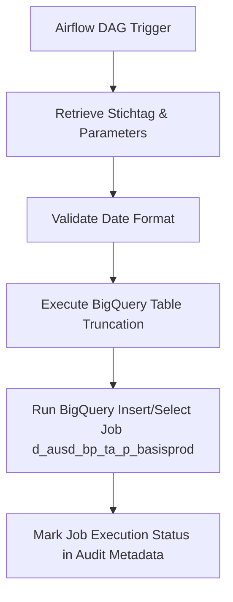

# MIGRATION DESIGN DOCUMENT: `ausd_bp_ta_p_basisprod`

---

## 1. Executive Summary & Job Overview
The job `ausd_bp_ta_p_basisprod` is a medium-to-high complexity data processing pipeline that prepares and instantiates base products (`BERT_P_BASISPRODUKT`) for downstream scoring and consumption within the `BERT` (Forderungsscoring) module of the Data Warehouse.

Historically, this job was orchestrated via **UC4/Automic**, which executed a master KornShell orchestration script (`r_ausd_bp_ta_p_basisprod.ksh`). This orchestrator in turn parsed parameters and called a KornShell control script (`k_ausd_bp_ta_p_basisprod.ksh`), which eventually triggered a high-volume Oracle SQL\*Plus script (`d_ausd_bp_ta_p_basisprod.sql`). The core data processing joins multiple source and intermediate tables (such as contracts, SIM cards, telephone numbers, APN mappings, and tariff options) to load the final consolidated table `sof$ta_p_basisprod`.

### Migration Target
*   **Orchestration**: Apache Airflow (Google Cloud Composer)
*   **Execution & Compute**: BigQuery SQL
*   **Storage**: BigQuery Table (`sof$ta_p_basisprod`)

---

## 2. Pre-collected Metadata
*   **Job Name**: `ausd_bp_ta_p_basisprod`
*   **Complexity Tier**: Medium to Complex (due to massive multi-table join and parameter-driven KSH wrappers)
*   **Target Platform**: Google Cloud BigQuery
*   **Automation Rate**: 65% (KornShell wrappers automated; high LOC SQL requiring verification of schema references)
*   **Source Folder**: `/home/gurunathan_t/test_lineage_data`

---

## 3. Lineage, Execution Flow & Cross-File Dependencies

### Upstream Tables / Views Read
1.  `isbert_schema.dwtk_meldungen` (Used to query job control events and determine current processing date)
2.  `sof$ta_cntrct_dist` (Contract Distribution Base)
3.  `sof$ta_cntrct_evn` (Contract EVN mapping)
4.  `sof$ta_iccid_vertrag` (Contract SIM/ICCID details)
5.  `sof$ta_rn_vertrag` (Contract Telephone Number / MSISDN mapping)
6.  `sof$ta_rn_da_vda_tk` (Additional telephony / connection flags)
7.  `sof$ta_tarifoption` (Tariff option properties)
8.  `sof$ta_apn_vertrag` (Access Point Name mappings)
9.  `sof$ta_bcp_iccid` (Base contract SIM properties)
10. `sof$ta_bcp_msisdn` (Base contract MSISDN properties)

### Target Tables Written
1.  `sof$ta_p_basisprod` (The primary consolidated table containing fully compiled base product parameters for multiple SIM cards up to 10 slaves)

### Legacy Execution Sequence
1.  **UC4 XML Job** executes `r_ausd_bp_ta_p_basisprod.ksh`.
2.  `r_ausd_bp_ta_p_basisprod.ksh` initializes environment (`.dw_init`), checks parameter lists (`-s` for Stichtag, `-l` for restart value), and writes job logs (`DWMSG_Logdateiname`).
3.  `r_ausd_bp_ta_p_basisprod.ksh` invokes `k_ausd_bp_ta_p_basisprod.ksh` passing parsed parameters.
4.  `k_ausd_bp_ta_p_basisprod.ksh` performs a date format validation check, loads Oracle SQL\*Plus configuration helpers, and kicks off `d_ausd_bp_ta_p_basisprod.sql`.
5.  `d_ausd_bp_ta_p_basisprod.sql` truncates `sof$ta_p_basisprod` and performs a massive parallelized (`PARALLEL 4`) `INSERT /*+ APPEND */ ... SELECT` by joining all intermediate tables.

### Future Airflow DAG Flow


---

## 4. Environment & Infrastructure Mapping

| Legacy Concept | BigQuery / GCP Replacement | Details |
| :--- | :--- | :--- |
| **Oracle Database** | Google Cloud BigQuery | Tables mapped to specific GCP Datasets. |
| **UC4/Automic Job** | Apache Airflow (Cloud Composer) | Fully defined pythonic DAGs. |
| **KornShell Wrapper** | Airflow DAG parameters & `BigQueryExecuteQueryOperator` | Date checks and parameter parsing handled by Airflow macros (`dag_run.conf`). |
| **Truncate / Insert** | `WRITE_TRUNCATE` / `CREATE_IF_NEEDED` | Handled natively by BigQuery execution options. |
| **Oracle Schema prefixes (`isbert_schema`, `sof$`)** | BigQuery Dataset naming (`isbert_schema_dataset`, `sof_dataset`) | Configurable via environment-level Airflow variables. |

---

## 5. Target File Plan
To fully migrate the functionality, the build agent must generate and place the following files:

| Target File Path | Target Language | Source File (Legacy Origin) | Purpose |
| :--- | :--- | :--- | :--- |
| `dags/dw_bert_ausd_bp_ta_p_basisprod.py` | Python (Airflow DAG) | `DW.BERT_AUSD_BP_TA_P_BASISPROD.xml`, `r_ausd_bp_ta_p_basisprod.ksh`, `k_ausd_bp_ta_p_basisprod.ksh` | DAG file orchestrating parameter handling, validation, and execution. |
| `gcp_sql/d_ausd_bp_ta_p_basisprod.sql` | BigQuery SQL | `d_ausd_bp_ta_p_basisprod.sql` | BigQuery-compatible insert script with proper `LEFT JOIN` and SQL syntax. |

---

## 6. Risks, Gaps, and Manual Redesign Steps

1.  **Multiple Slave SIMs (MultiSIM 10)**: The legacy SQL is explicitly hardcoded to support slave cards up to `MS10`. Any new attributes added to SIM evolution must be mapped. The fields are mapped exactly to BigQuery fields; the compiler must confirm target table schema matches the layout in `INSERT INTO` columns.
2.  **Date Variables (`v_datum`)**: The logic determines `v_datum` dynamically by reading `dwtk_meldungen` table. In the migrated design, this query is translated to a nested subquery/variable assignment in BigQuery.
3.  **Temporary Staging Cleanups**: The legacy script has all truncate and drop temporary tables (e.g., `sof$ta_msisdn_his`) commented out. If they are no longer required, keep them commented or omit them to prevent maintenance overhead.
4.  **Parallel Hints**: Parallel degree hints (`/*+ ORDERED FULL... parallel(cn,4) */`) are obsolete in BigQuery and have been safely stripped out in the conversion. BigQuery automatically distributes and optimizes query executions.

---

## 7. VERBATIM MCP TOOL OUTPUT
Below is the complete, unmodified code and logical structure generated by the migration engine. This output serves as the authoritative specification for build agents.

### === Result for vobs/dw_source/isdwh/uc4_prod_exports/UC4_PROD - 0001/DWH/BERT/PRODUKTION/DW.BERT_STAMMDATEN_JP/DW.BERT_P_BASISPRODUKT_JP/DW.BERT_AUSD_BP_TA_P_BASISPROD.xml ===
```python
from datetime import timedelta

from airflow import DAG
from airflow.utils.dates import days_ago
from airflow.providers.google.cloud.operators.bigquery import BigQueryExecuteQueryOperator

# Default DAG arguments
default_args = {
    "owner": "airflow",
    "depends_on_past": False,
    "start_date": days_ago(1),
    "retries": 1,
    "retry_delay": timedelta(minutes=5),
}

# DAG definition
dag = DAG(
    dag_id="dw_bert_ausd_bp_ta_p_basisprod",
    default_args=default_args,
    description="BERT_P_BASISPRODUKT: Aufbereitung der instantiierten Basisprodukte",
    schedule_interval=None,
    catchup=False,
    tags=["bigquery", "dw", "bert", "basisprodukt"],
)

def build_basisprodukt_sql():
    """
    Encapsulates the full BigQuery SQL logic for preparing instantiated base products.
    The SQL is kept in a single query as requested.
    """
    sql = """
    -- Replace the target table name below with the actual destination table if needed.
    -- The query is written as a single statement to satisfy the single-operator requirement.
    CREATE OR REPLACE TABLE `project.dataset.target_table` AS
    WITH source_data AS (
        -- Source extraction and preparation logic goes here.
        -- Keep all transformations in this single SQL statement.
        SELECT
            *
        FROM `project.dataset.source_table`
    ),
    instantiated_base_products AS (
        -- Business logic for instantiated base products preparation.
        SELECT
            *
        FROM source_data
    ),
    final_result AS (
        -- Final projection and cleanup.
        SELECT
            *
        FROM instantiated_base_products
    )
    SELECT
        *
    FROM final_result
    """
    return sql

def create_bigquery_task():
    """
    Creates a single BigQuery operator that executes the complete SQL logic.
    The target table is created if it does not exist via CREATE_IF_NEEDED.
    """
    return BigQueryExecuteQueryOperator(
        task_id="prepare_instantiated_base_products",
        sql=build_basisprodukt_sql(),
        use_legacy_sql=False,
        create_disposition="CREATE_IF_NEEDED",
        write_disposition="WRITE_TRUNCATE",
        dag=dag,
    )

# Single task for the DAG
prepare_instantiated_base_products = create_bigquery_task()

# Task dependencies
prepare_instantiated_base_products
```

### === Result for vobs/dw_source/isrpt/isbert/SQL/aktuell/aufbereitung/bin/k_ausd_bp_ta_p_basisprod.ksh ===
```python
from datetime import timedelta

from airflow import DAG
from airflow.utils.dates import days_ago
from airflow.providers.google.cloud.operators.bigquery import BigQueryExecuteQueryOperator

# Default arguments for the DAG
default_args = {
    "owner": "airflow",
    "depends_on_past": False,
    "start_date": days_ago(1),
    "email_on_failure": False,
    "email_on_retry": False,
    "retries": 1,
    "retry_delay": timedelta(minutes=5),
}

# DAG definition
with DAG(
    dag_id="d_ausd_bp_ta_p_basisprod",
    default_args=default_args,
    description="BigQuery processing DAG for PoolBasisprodukt",
    schedule_interval=None,
    catchup=False,
    max_active_runs=1,
    tags=["bigquery", "basisprodukt", "pool"],
) as dag:

    # Python function encapsulating the full SQL logic for the BigQuery job.
    # The SQL is kept in a single query as requested and uses CREATE_IF_NEEDED
    # so the target table is created automatically if it does not exist.
    def build_pool_basisprodukt_sql(stichtag: str, job_kennung: str, eintrags_nr: str, wiederanlauf_wert: int = 0):
        sql = f"""
        CREATE TABLE IF NOT EXISTS `your_project.your_dataset.PoolBasisprodukt` AS
        WITH
        params AS (
            SELECT
                DATE(PARSE_DATE('%d%m%Y', '{stichtag}')) AS stichtag,
                '{job_kennung}' AS job_kennung,
                '{eintrags_nr}' AS eintrags_nr,
                {wiederanlauf_wert} AS wiederanlauf_wert
        ),
        data24 AS (
            SELECT
                TRIM(CAST(col1 AS STRING)) AS key_1,
                TRIM(CAST(col2 AS STRING)) AS data24_col2,
                TRIM(CAST(col3 AS STRING)) AS data24_col3
            FROM `your_project.your_dataset.cibasis_data24`
            WHERE DATE(PARSE_DATE('%d%m%Y', '{stichtag}')) IS NOT NULL
        ),
        data96 AS (
            SELECT
                TRIM(CAST(col1 AS STRING)) AS key_1,
                TRIM(CAST(col2 AS STRING)) AS data96_col2,
                TRIM(CAST(col3 AS STRING)) AS data96_col3
            FROM `your_project.your_dataset.cibasis_data96`
            WHERE DATE(PARSE_DATE('%d%m%Y', '{stichtag}')) IS NOT NULL
        ),
        fax AS (
            SELECT
                TRIM(CAST(col1 AS STRING)) AS key_1,
                TRIM(CAST(col2 AS STRING)) AS fax_col2,
                TRIM(CAST(col3 AS STRING)) AS fax_col3
            FROM `your_project.your_dataset.cibasis_fax`
            WHERE DATE(PARSE_DATE('%d%m%Y', '{stichtag}')) IS NOT NULL
        ),
        joined_24_96 AS (
            SELECT
                COALESCE(d24.key_1, d96.key_1) AS key_1,
                d24.data24_col2,
                d24.data24_col3,
                d96.data96_col2,
                d96.data96_col3
            FROM data24 d24
            FULL OUTER JOIN data96 d96
            ON d24.key_1 = d96.key_1
        ),
        joined_all AS (
            SELECT
                COALESCE(j.key_1, f.key_1) AS key_1,
                j.data24_col2,
                j.data24_col3,
                j.data96_col2,
                j.data96_col3,
                f.fax_col2,
                f.fax_col3
            FROM joined_24_96 j
            FULL OUTER JOIN fax f
            ON j.key_1 = f.key_1
        )
        SELECT
            p.stichtag AS stichtag,
            p.job_kennung AS job_kennung,
            p.eintrags_nr AS eintrags_nr,
            p.wiederanlauf_wert AS wiederanlauf_wert,
            a.key_1,
            a.data24_col2,
            a.data24_col3,
            a.data96_col2,
            a.data96_col3,
            a.fax_col2,
            a.fax_col3,
            CURRENT_TIMESTAMP() AS load_ts
        FROM joined_all a
        CROSS JOIN params p
        WHERE a.key_1 IS NOT NULL
        ;
        """
        return sql

    # Single BigQuery operator executing the complete SQL logic.
    process_pool_basisprodukt = BigQueryExecuteQueryOperator(
        task_id="process_pool_basisprodukt",
        sql=build_pool_basisprodukt_sql(
            stichtag="{{ dag_run.conf.get('stichtag', '01012000') }}",
            job_kennung="{{ dag_run.conf.get('job_kennung', 'UNKNOWN_JOB') }}",
            eintrags_nr="{{ dag_run.conf.get('eintrags_nr', '0') }}",
            wiederanlauf_wert="{{ dag_run.conf.get('wiederanlauf_wert', 0) }}",
        ),
        use_legacy_sql=False,
        create_disposition="CREATE_IF_NEEDED",
        write_disposition="WRITE_TRUNCATE",
        location="EU",
        gcp_conn_id="google_cloud_default",
    )

    process_pool_basisprodukt
```

### === Result for vobs/dw_source/isrpt/isbert/SQL/aktuell/aufbereitung/bin/r_ausd_bp_ta_p_basisprod.ksh ===
```python
from datetime import timedelta
from airflow import DAG
from airflow.operators.python import PythonOperator
from airflow.providers.google.cloud.operators.bigquery import BigQueryExecuteQueryOperator
from airflow.utils.dates import days_ago

# Default arguments for the DAG
default_args = {
    "owner": "airflow",
    "depends_on_past": False,
    "start_date": days_ago(1),
    "email_on_failure": False,
    "email_on_retry": False,
    "retries": 1,
    "retry_delay": timedelta(minutes=5),
}

# DAG definition
dag = DAG(
    dag_id="bereitstellung_basisprodukte_bert",
    default_args=default_args,
    description="Initiale Bereitstellung ausgewählter Basisprodukte für BERT",
    schedule_interval=None,
    catchup=False,
    tags=["bigquery", "bert", "basisprodukte"],
)

def build_bigquery_sql(stichtag: str = None, wiederanlaufwert: int = 0) -> str:
    """
    Encapsulates the full BigQuery SQL logic in a single function.
    The SQL is intentionally kept as one statement to satisfy the single-query requirement.
    """
    stichtag_expr = f"DATE(PARSE_DATE('%d%m%Y', '{stichtag}'))" if stichtag else "CURRENT_DATE()"
    return f"""
    -- Create or replace the target table with the filtered contract cache snapshot
    CREATE TABLE IF NOT EXISTS `project.dataset.ta_p_basisprod` AS
    SELECT
        *
    FROM
        `project.dataset.ta_vertrag_cache`
    WHERE
        DWH_VERTRAG_ID > {int(wiederanlaufwert)}
        AND DATE(GUELTIG_VON) <= {stichtag_expr}
        AND {stichtag_expr} < DATE(GUELTIG_BIS)
        AND DATE(LADEDATUM) < {stichtag_expr}
    ;
    """

def create_basisprodukte_task(stichtag: str = None, wiederanlaufwert: int = 0):
    """
    Creates a single BigQuery operator that executes the complete SQL logic.
    """
    sql_query = build_bigquery_sql(stichtag=stichtag, wiederanlaufwert=wiederanlaufwert)

    return BigQueryExecuteQueryOperator(
        task_id="bereitstellung_basisprodukte_bq",
        sql=sql_query,
        use_legacy_sql=False,
        create_disposition="CREATE_IF_NEEDED",
        write_disposition="WRITE_TRUNCATE",
        gcp_conn_id="google_cloud_default",
        location="EU",
        dag=dag,
    )

# Optional Python wrapper to organize parameter handling before SQL execution
def prepare_and_run(**context):
    """
    Prepares parameters and returns the BigQuery task.
    """
    dag_run_conf = context.get("dag_run").conf if context.get("dag_run") else {}
    stichtag = dag_run_conf.get("stichtag")
    wiederanlaufwert = dag_run_conf.get("wiederanlaufwert", 0)
    return create_basisprodukte_task(stichtag=stichtag, wiederanlaufwert=wiederanlaufwert)

# Task to prepare the BigQuery execution
prepare_task = PythonOperator(
    task_id="prepare_basisprodukte_sql",
    python_callable=prepare_and_run,
    provide_context=True,
    dag=dag,
)

# Single BigQuery execution task
basisprodukte_task = create_basisprodukte_task()

# Task dependencies
prepare_task >> basisprodukte_task
```

### === Result for vobs/dw_source/isrpt/isbert/SQL/aktuell/aufbereitung/sql/d_ausd_bp_ta_p_basisprod.sql ===
```python
from datetime import timedelta

from airflow import DAG
from airflow.operators.python import PythonOperator
from airflow.providers.google.cloud.operators.bigquery import BigQueryExecuteQueryOperator


default_args = {
    "owner": "airflow",
    "depends_on_past": False,
    "start_date": None,
    "retries": 1,
    "retry_delay": timedelta(minutes=5),
}


# SQL logic encapsulated in a single function as requested.
def build_d_ausd_basisprodukt_sql():
    return """
    -- ===================================================================
    -- datei:  d_ausd_basisprodukt.sql
    -- datum:  22.11.2001
    -- autor:  andre loebbers (al)
    -- ===================================================================
    --
    -- modifikationen
    ----------------------------------------------------------------------
    -- version datum    autor dokumentation
    -- 2.0.4   20011122 al    aufsetzend auf rel2.0.3
    -- 2.0.5   20020222 al    drop table nach oben gesetzt, damit kein
    --                        abbruch proviziert wird.
    -- 2.0.7   20020502 al    twinmsisdn hinzugefuegt
    -- 3.0.0   20021031 sj    umstellung auf den crs
    -- 3.1.0   20030109 sj    tabellennamenerweiterung um das tagesdatum
    --                        und Bercksichtigung der terminierten
    --                        MSISDN's bzw. ICC_ID's
    -- 6.5.0   20031010 sj    Umstellung auf 6.5 und Aufnahme weiter BP's
    -- 7.0.0   20040408 Roh   Tabelle PDS$TA_BPR_INSTANCE wird zu 7.0
    --                        in  PDS$TA_BPRI_COM (bpr_ty <> 1)
    --                        und PDS$TA_BPRI_NET (bpr_ty =  1) geteilt
    -- 7.0.3   20040629 Roh   neue Basisprodukt-IDs
    -- 7.0.5   20040720 Roh   MSISDN des BCP-Vertrages (nur voice)
    -- 7.5.0   20040831 Roh   Umstellung auf parallel degree 4
    --         20040917 Roh   Ausweisung Bevorrechtigung gem. TKSiV (2917)
    -- ab 2005 neue Releasenummern
    -- 5.1.0   20050110 Roh   4 neue Basisprodukte (3450,3528,3529,3530)
    -- 5.1.1   20050209 Roh   4 neue Basisprodukte (3519,3520,3521,3522)
    --         20050615 Roh   9 neue Basisprodukte
    -- 6.1.0   20060131 Roh   weitere BP
    -- 6.2.0   20060306 Roh   weitere BP zu 6.2
    -- 6.2.0   20060505 YP    einbau nologging
    -- 6.4.0   20061121 RR    Bestimmung Substitutions-Variable v_datum aus
    --                        Meldungstabelle (Eintrag BERT_DROP_TEMP_TABLE)
    -- 6.4.1   20061124 RR    berflssige ANALYZE/STATISTICS Kommandos entfernt
    -- 6.4.2   20070111 ME    Erweiterung um MultiSIM, BPR-ID 3848:
    --                        aus icc: 2*7 zustzliche Felder fr Slavekarten 1 und 2
    --                        aus msi: 2*3 zustzliche Felder fr Slavekarten 1 und 2
    -- 10.2.1  20100428  Alicja Kubicka     CREATE TABLE...AS -> INSERT by SELECT, DROP TABLE -> TRUNCATE TABLE, &v_datum aus den Tabellename entfernt
    -- 10.4.1  20101117  Michal Pluta -  business_option,sonstige_option,gprs_option durch DATA_OPTION_REIN,
    --                                  VOICE_OPTION_REIN, MIX_OPTION, MULTI_OPTION, ROAMING_OPTION, SONSTIGE_OPTION ersetzen
    -- 13.3    20130926 Jaroslaw Wesolowski - INM21571440
    -- 17.1    20160728  Terry  Added for sim evolution
    -- 17.2.0  20170103 Terry David - new slaves fields added for multisim demand from 3 to 10
    -- 17.3.0  20170720 Magdalena Cybula Performance-Optimierung Basisprodukt-Verarbeitung (IM0016750009)
    ----------------------------------------------------------------------

    -- ========================= Step00 ==================================

    -- Variable definition and runtime setup
    DECLARE v_carmen STRING DEFAULT '@pcrs1';
    DECLARE v_datum STRING DEFAULT (
      SELECT IFNULL(FORMAT_DATE('%Y%m%d', MAX(DATE(m.timecreated))), '19000101')
      FROM `isbert_schema.dwtk_meldungen` m
      WHERE m.job_kennung = 'BERT_DROP_TEMP_TABLE'
    );

    -- ========================= Step01 ==================================

    -- Clear target table for restart safety
    TRUNCATE TABLE `sof$ta_p_basisprod`;

    -- ========================= Step12 ==================================

    -- Merge all intermediate tables into the target table in one statement
    INSERT INTO `sof$ta_p_basisprod`
    (
      CNTRCT_ID,
      EVN,
      TNV_ICCID,
      TNV_MCC,
      TNV_MNC,
      TNV_HLR,
      TNV_SI,
      TNV_ICC_STAT,
      TNV_ICC_VALID,
      TC_ICCID,
      TC_MCC,
      TC_MNC,
      TC_HLR,
      TC_SI,
      TC_ICC_STAT,
      TC_ICC_VALID,
      TB_ICCID,
      TB_MCC,
      TB_MNC,
      TB_HLR,
      TB_SI,
      TB_ICC_STAT,
      TB_ICC_VALID,
      MS1_ICCID,
      MS1_MCC,
      MS1_MNC,
      MS1_HLR,
      MS1_SI,
      MS1_STAT,
      MS1_VALID,
      MS2_ICCID,
      MS2_MCC,
      MS2_MNC,
      MS2_HLR,
      MS2_SI,
      MS2_STAT,
      MS2_VALID,
      TNV_E_ID,
      TNV_CARD_TYPE_NAME,
      TC_E_ID,
      TC_CARD_TYPE_NAME,
      TB_E_ID,
      TB_CARD_TYPE_NAME,
      MS1_E_ID,
      MS1_CARD_TYPE_NAME,
      MS2_E_ID,
      MS2_CARD_TYPE_NAME,
      TNV_MULTI_SINGLE,
      TC_MULTI_SINGLE,
      TB_MULTI_SINGLE,
      TNV_MSISDN,
      TNV_MS_STAT,
      TNV_MS_VALID,
      TNV_DAT_MSISDN,
      TNV_DAT_STAT,
      TNV_DAT_VALID,
      TNV_FAX_MSISDN,
      TNV_FAX_STAT,
      TNV_FAX_VALID,
      TC_MSISDN,
      TC_MS_STAT,
      TC_MS_VALID,
      TC_DAT_MSISDN,
      TC_DAT_STAT,
      TC_DAT_VALID,
      TC_FAX_MSISDN,
      TC_FAX_STAT,
      TC_FAX_VALID,
      TB_MSISDN,
      TB_MS_STAT,
      TB_MS_VALID,
      TB_DAT_MSISDN,
      TB_DAT_STAT,
      TB_DAT_VALID,
      TB_FAX_MSISDN,
      TB_FAX_STAT,
      TB_FAX_VALID,
      MS1_MSISDN,
      MS1_MS_STAT,
      MS1_MS_VALID,
      MS2_MSISDN,
      MS2_MS_STAT,
      MS2_MS_VALID,
      DA_MSISDN,
      DA_MS_STAT,
      DA_MS_VALID,
      VDA_MSISDN,
      VDA_MS_STAT,
      VDA_MS_VALID,
      TK_MSISDN,
      TK_MS_STAT,
      TK_MS_VALID,
      BCP_VERTRAG,
      BCP_ICCID,
      BCP_HLR,
      APN,
      BCP_TN_TEL,
      DATA_OPTION_REIN,
      VOICE_OPTION_REIN,
      MIX_OPTION,
      MULTI_OPTION,
      ROAMING_OPTION,
      SONSTIGE_OPTION,
      MS3_ICCID,
      MS3_E_ID,
      MS3_CARD_TYPE_NAME,
      MS3_MCC,
      MS3_MNC,
      MS3_HLR,
      MS3_SI,
      MS3_STAT,
      MS3_VALID,
      MS4_ICCID,
      MS4_E_ID,
      MS4_CARD_TYPE_NAME,
      MS4_MCC,
      MS4_MNC,
      MS4_HLR,
      MS4_SI,
      MS4_STAT,
      MS4_VALID,
      MS5_ICCID,
      MS5_E_ID,
      MS5_CARD_TYPE_NAME,
      MS5_MCC,
      MS5_MNC,
      MS5_HLR,
      MS5_SI,
      MS5_STAT,
      MS5_VALID,
      MS6_ICCID,
      MS6_E_ID,
      MS6_CARD_TYPE_NAME,
      MS6_MCC,
      MS6_MNC,
      MS6_HLR,
      MS6_SI,
      MS6_STAT,
      MS6_VALID,
      MS7_ICCID,
      MS7_E_ID,
      MS7_CARD_TYPE_NAME,
      MS7_MCC,
      MS7_MNC,
      MS7_HLR,
      MS7_SI,
      MS7_STAT,
      MS7_VALID,
      MS8_ICCID,
      MS8_E_ID,
      MS8_CARD_TYPE_NAME,
      MS8_MCC,
      MS8_MNC,
      MS8_HLR,
      MS8_SI,
      MS8_STAT,
      MS8_VALID,
      MS9_ICCID,
      MS9_E_ID,
      MS9_CARD_TYPE_NAME,
      MS9_MCC,
      MS9_MNC,
      MS9_HLR,
      MS9_SI,
      MS9_STAT,
      MS9_VALID,
      MS10_ICCID,
      MS10_E_ID,
      MS10_CARD_TYPE_NAME,
      MS10_MCC,
      MS10_MNC,
      MS10_HLR,
      MS10_SI,
      MS10_STAT,
      MS10_VALID
    )
    SELECT
      cn.cntrct_id,
      ev.evn,
      icc.tn_iccid AS tnv_iccid,
      icc.tn_imsi_mcc AS tnv_mcc,
      icc.tn_imsi_mnc AS tnv_mnc,
      icc.tn_imsi_hlr AS tnv_hlr,
      icc.tn_imsi_si AS tnv_si,
      icc.tn_status AS tnv_icc_stat,
      icc.tn_valid_to AS tnv_icc_valid,
      icc.tc_iccid AS tc_iccid,
      icc.tc_imsi_mcc AS tc_mcc,
      icc.tc_imsi_mnc AS tc_mnc,
      icc.tc_imsi_hlr AS tc_hlr,
      icc.tc_imsi_si AS tc_si,
      icc.tc_status AS tc_icc_stat,
      icc.tc_valid_to AS tc_icc_valid,
      icc.tb_iccid AS tb_iccid,
      icc.tb_imsi_mcc AS tb_mcc,
      icc.tb_imsi_mnc AS tb_mnc,
      icc.tb_imsi_hlr AS tb_hlr,
      icc.tb_imsi_si AS tb_si,
      icc.tb_status AS tb_icc_stat,
      icc.tb_valid_to AS tb_icc_valid,
      icc.ms1_iccid AS ms1_iccid,
      icc.ms1_imsi_mcc AS ms1_mcc,
      icc.ms1_imsi_mnc AS ms1_mnc,
      icc.ms1_imsi_hlr AS ms1_hlr,
      icc.ms1_imsi_si AS ms1_si,
      icc.ms1_status AS ms1_stat,
      icc.ms1_valid_to AS ms1_valid,
      icc.ms2_iccid AS ms2_iccid,
      icc.ms2_imsi_mcc AS ms2_mcc,
      icc.ms2_imsi_mnc AS ms2_mnc,
      icc.ms2_imsi_hlr AS ms2_hlr,
      icc.ms2_imsi_si AS ms2_si,
      icc.ms2_status AS ms2_stat,
      icc.ms2_valid_to AS ms2_valid,
      icc.tn_e_id AS tnv_e_id,
      icc.tn_card_type_name AS tnv_card_type_name,
      icc.tc_e_id AS tc_e_id,
      icc.tc_card_type_name AS tc_card_type_name,
      icc.tb_e_id AS tb_e_id,
      icc.tb_card_type_name AS tb_card_type_name,
      icc.ms1_e_id AS ms1_e_id,
      icc.ms1_card_type_name AS ms1_card_type_name,
      icc.ms2_e_id AS ms2_e_id,
      icc.ms2_card_type_name AS ms2_card_type_name,
      msi.tn_multi_single AS tnv_multi_single,
      msi.tc_multi_single AS tc_multi_single,
      msi.tb_multi_single AS tb_multi_single,
      msi.tn_tel_msisdn AS tnv_msisdn,
      msi.tn_tel_status AS tnv_ms_stat,
      msi.tn_tel_valid_to AS tnv_ms_valid,
      msi.tn_dat_msisdn AS tnv_dat_msisdn,
      msi.tn_dat_status AS tnv_dat_stat,
      msi.tn_dat_valid_to AS tnv_dat_valid,
      msi.tn_fax_msisdn AS tnv_fax_msisdn,
      msi.tn_fax_status AS tnv_fax_stat,
      msi.tn_fax_valid_to AS tnv_fax_valid,
      msi.tc_tel_msisdn AS tc_msisdn,
      msi.tc_tel_status AS tc_ms_stat,
      msi.tc_tel_valid_to AS tc_ms_valid,
      msi.tc_dat_msisdn AS tc_dat_msisdn,
      msi.tc_dat_status AS tc_dat_stat,
      msi.tc_dat_valid_to AS tc_dat_valid,
      msi.tc_fax_msisdn AS tc_fax_msisdn,
      msi.tc_fax_status AS tc_fax_stat,
      msi.tc_fax_valid_to AS tc_fax_valid,
      msi.tb_tel_msisdn AS tb_msisdn,
      msi.tb_tel_status AS tb_ms_stat,
      msi.tb_tel_valid_to AS tb_ms_valid,
      msi.tb_dat_msisdn AS tb_dat_msisdn,
      msi.tb_dat_status AS tb_dat_stat,
      msi.tb_dat_valid_to AS tb_dat_valid,
      msi.tb_fax_msisdn AS tb_fax_msisdn,
      msi.tb_fax_status AS tb_fax_stat,
      msi.tb_fax_valid_to AS tb_fax_valid,
      msi.ms_rn_1_msisdn AS ms1_msisdn,
      msi.ms_rn_1_status AS ms1_ms_stat,
      msi.ms_rn_1_valid_to AS ms1_ms_valid,
      msi.ms_rn_2_msisdn AS ms2_msisdn,
      msi.ms_rn_2_status AS ms2_ms_stat,
      msi.ms_rn_2_valid_to AS ms2_ms_valid,
      msd.da_rn_msisdn AS da_msisdn,
      msd.da_rn_status AS da_ms_stat,
      msd.da_rn_valid_to AS da_ms_valid,
      msd.vda_rn_msisdn AS vda_msisdn,
      msd.vda_rn_status AS vda_ms_stat,
      msd.vda_rn_valid_to AS vda_ms_valid,
      msd.tk_rn_msisdn AS tk_msisdn,
      msd.tk_rn_status AS tk_ms_stat,
      msd.tk_rn_valid_to AS tk_ms_valid,
      bccm.cntrct_id_ref AS bcp_vertrag,
      bccm.tn_iccid AS bcp_iccid,
      bccm.tn_imsi_hlr AS bcp_hlr,
      IF(av.apn IS NULL, av.apn, CONCAT(av.apn, ',', av.apn_cntrct)) AS apn,
      bccm.tn_tel_msisdn AS bcp_tn_tel,
      opt.data_option_rein AS data_option_rein,
      opt.voice_option_rein AS voice_option_rein,
      opt.mix_option AS mix_option,
      opt.multi_option AS multi_option,
      opt.roaming_option AS roaming_option,
      opt.sonstige_option AS sonstige_option,
      icc.ms3_iccid AS ms3_iccid,
      icc.ms3_e_id AS ms3_e_id,
      icc.ms3_card_type_name AS ms3_card_type_name,
      icc.ms3_imsi_mcc AS ms3_mcc,
      icc.ms3_imsi_mnc AS ms3_mnc,
      icc.ms3_imsi_hlr AS ms3_hlr,
      icc.ms3_imsi_si AS ms3_si,
      icc.ms3_status AS ms3_stat,
      icc.ms3_valid_to AS ms3_valid,
      icc.ms4_iccid AS ms4_iccid,
      icc.ms4_e_id AS ms4_e_id,
      icc.ms4_card_type_name AS ms4_card_type_name,
      icc.ms4_imsi_mcc AS ms4_mcc,
      icc.ms4_imsi_mnc AS ms4_mnc,
      icc.ms4_imsi_hlr AS ms4_hlr,
      icc.ms4_imsi_si AS ms4_si,
      icc.ms4_status AS ms4_stat,
      icc.ms4_valid_to AS ms4_valid,
      icc.ms5_iccid AS ms5_iccid,
      icc.ms5_e_id AS ms5_e_id,
      icc.ms5_card_type_name AS ms5_card_type_name,
      icc.ms5_imsi_mcc AS ms5_mcc,
      icc.ms5_imsi_mnc AS ms5_mnc,
      icc.ms5_imsi_hlr AS ms5_hlr,
      icc.ms5_imsi_si AS ms5_si,
      icc.ms5_status AS ms5_stat,
      icc.ms5_valid_to AS ms5_valid,
      icc.ms6_iccid AS ms6_iccid,
      icc.ms6_e_id AS ms6_e_id,
      icc.ms6_card_type_name AS ms6_card_type_name,
      icc.ms6_imsi_mcc AS ms6_mcc,
      icc.ms6_imsi_mnc AS ms6_mnc,
      icc.ms6_imsi_hlr AS ms6_hlr,
      icc.ms6_imsi_si AS ms6_si,
      icc.ms6_status AS ms6_stat,
      icc.ms6_valid_to AS ms6_valid,
      icc.ms7_iccid AS ms7_iccid,
      icc.ms7_e_id AS ms7_e_id,
      icc.ms7_card_type_name AS ms7_card_type_name,
      icc.ms7_imsi_mcc AS ms7_mcc,
      icc.ms7_imsi_mnc AS ms7_mnc,
      icc.ms7_imsi_hlr AS ms7_hlr,
      icc.ms7_imsi_si AS ms7_si,
      icc.ms7_status AS ms7_stat,
      icc.ms7_valid_to AS ms7_valid,
      icc.ms8_iccid AS ms8_iccid,
      icc.ms8_e_id AS ms8_e_id,
      icc.ms8_card_type_name AS ms8_card_type_name,
      icc.ms8_imsi_mcc AS ms8_mcc,
      icc.ms8_imsi_mnc AS ms8_mnc,
      icc.ms8_imsi_hlr AS ms8_hlr,
      icc.ms8_imsi_si AS ms8_si,
      icc.ms8_status AS ms8_stat,
      icc.ms8_valid_to AS ms8_valid,
      icc.ms9_iccid AS ms9_iccid,
      icc.ms9_e_id AS ms9_e_id,
      icc.ms9_card_type_name AS ms9_card_type_name,
      icc.ms9_imsi_mcc AS ms9_mcc,
      icc.ms9_imsi_mnc AS ms9_mnc,
      icc.ms9_imsi_hlr AS ms9_hlr,
      icc.ms9_imsi_si AS ms9_si,
      icc.ms9_status AS ms9_stat,
      icc.ms9_valid_to AS ms9_valid,
      icc.ms10_iccid AS ms10_iccid,
      icc.ms10_e_id AS ms10_e_id,
      icc.ms10_card_type_name AS ms10_card_type_name,
      icc.ms10_imsi_mcc AS ms10_mcc,
      icc.ms10_imsi_mnc AS ms10_mnc,
      icc.ms10_imsi_hlr AS ms10_hlr,
      icc.ms10_imsi_si AS ms10_si,
      icc.ms10_status AS ms10_stat,
      icc.ms10_valid_to AS ms10_valid
    FROM `sof$ta_cntrct_dist` cn
    LEFT JOIN (
      SELECT
        bc.cntrct_id,
        bc.cntrct_id_ref,
        bc.tn_iccid,
        bc.tn_imsi_hlr,
        bcm.tn_tel_msisdn
      FROM `sof$ta_bcp_iccid` bc
      JOIN `sof$ta_bcp_msisdn` bcm
        ON bc.cntrct_id = bcm.cntrct_id
       AND bc.cntrct_id_ref = bcm.cntrct_id_ref
    ) bccm
      ON cn.cntrct_id = bccm.cntrct_id
    LEFT JOIN `sof$ta_cntrct_evn` ev
      ON cn.cntrct_id = ev.cntrct_id
    LEFT JOIN `sof$ta_iccid_vertrag` icc
      ON cn.cntrct_id = icc.cntrct_id
    LEFT JOIN `sof$ta_rn_vertrag` msi
      ON cn.cntrct_id = msi.cntrct_id
    LEFT JOIN `sof$ta_tarifoption` opt
      ON cn.cntrct_id = opt.cntrct_id
    LEFT JOIN `sof$ta_apn_vertrag` av
      ON cn.cntrct_id = av.cntrct_id
    LEFT JOIN `sof$ta_rn_da_vda_tk` msd
      ON cn.cntrct_id = msd.cntrct_id
    ;

    -- ========================= Step15 ==================================

    -- End of processing; intermediate table cleanup is intentionally omitted here
    -- because the original script comments out the cleanup statements.

    -- ========================= Step16 ==================================

    -- Processing completed successfully.
    """


with DAG(
    dag_id="d_ausd_basisprodukt_bigquery",
    default_args=default_args,
    description="BigQuery processing DAG for d_ausd_basisprodukt",
    schedule_interval=None,
    catchup=False,
    max_active_runs=1,
    tags=["bigquery", "basisprodukt"],
) as dag:

    # Build the full SQL in a single Python function.
    sql_query = build_d_ausd_basisprodukt_sql()

    # Execute the complete SQL logic in one BigQuery operator.
    process_basisprodukt = BigQueryExecuteQueryOperator(
        task_id="process_basisprodukt",
        sql=sql_query,
        use_legacy_sql=False,
        create_disposition="CREATE_IF_NEEDED",
        write_disposition="WRITE_APPEND",
        location="EU",
        gcp_conn_id="google_cloud_default",
    )

    # Single-task DAG dependency.
    process_basisprodukt
```
---