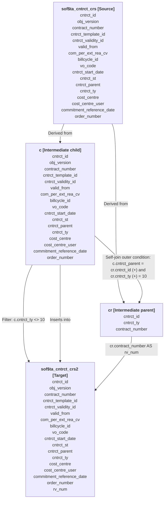

An implementation-ready **MIGRATION DESIGN DOCUMENT** for the **DW.BERT_AUSD_V_TA_CNTRCT_CRS2** data warehouse job has been constructed below.

This design incorporates the **Prescribed Migration Pattern** of **High Confidence** (`UC4+KSH+SQL_MEDIUM`), mapping the source systems and legacy scripts directly into a modernized architecture using **Cloud Composer (Apache Airflow)**, **Dataform (BigQuery SQLX)**, and **BigQuery**.

---

# MIGRATION DESIGN DOCUMENT

## 1. Executive Summary & Architecture Overview

The purpose of the `DW.BERT_AUSD_V_TA_CNTRCT_CRS2` job is to process contract data, resolve parent-child relationships for contract agreements (specifically excluding frame contract parents while preserving reference numbers on child contracts), and update the target contract staging table.

### Target Architecture Mapping
*   **Orchestration**: UC4 / Automic schedules and shell wrappers are replaced by a **Cloud Composer (Apache Airflow 2.x)** DAG.
*   **Transformation Engine**: The Oracle SQL*Plus script (`d_ausd_v_ta_cntrct_crs2.sql`) is converted to a production-ready **Dataform SQLX** incremental/overwrite script running natively on **BigQuery**.
*   **Parameter & State Management**: Variable lookups (such as fetching historical dates from logging tables) are replaced with clean SQL subqueries or Dataform configuration parameters.

---

## 2. Source-to-Target Data Flow Lineage

The data flow structure for resolving frame contracts (derived from the automated SAT analysis) is represented in the diagram below:

### Visual Lineage Flow (Merbatim Representation)


### Dependency Mapping
1.  **Upstream Input Table**: `sof$ta_cntrct_crs` (Pre-staged contract table).
2.  **Downstream Output Table**: `sof$ta_cntrct_crs2` (Processed contract staging table).
3.  **Audit/Logging Lookup**: `dwtk_meldungen` (Used historically to verify when temporary tables were dropped).

---

## 3. Targeted Code Conversions

### 3.1 Orchestration Conversion: Cloud Composer DAG
The original UC4 XML configuration (`DW.BERT_AUSD_V_TA_CNTRCT_CRS2.xml`) and the wrapper/control scripts (`r_ausd_v_ta_cntrct_crs2.ksh`, `k_ausd_v_ta_cntrct_crs2.ksh`) are replaced by a single Airflow DAG executing the Dataform execution lifecycle.

#### Target File: `dags/dag_dw_bert_ausd_v_ta_cntrct_crs2.py`
```python
import datetime
from airflow import DAG
from airflow.providers.google.cloud.operators.dataform import (
    DataformCreateCompilationResultOperator,
    DataformWriteCompilationResultActionOperator,
    DataformStartWorkflowInvocationOperator
)
from airflow.operators.empty import EmptyOperator

# Variables matching environment profiles
PROJECT_ID = "gcp-project-id"
REGION = "europe-west3"
REPOSITORY_ID = "dwh-bert-dataform"

default_args = {
    'owner': 'Data-Warehouse-Migration',
    'start_date': datetime.datetime(2026, 1, 1),
    'retries': 1,
    'retry_delay': datetime.timedelta(minutes=5),
}

with DAG(
    'dw_bert_ausd_v_ta_cntrct_crs2',
    default_args=default_args,
    schedule_interval='0 2 * * *',  # Nightly execution
    catchup=False,
    tags=['DWH', 'BERT', 'Contracts'],
) as dag:

    start = EmptyOperator(task_id='start')

    # Trigger compilation of Dataform project
    compile_dataform = DataformCreateCompilationResultOperator(
        task_id='compile_dataform',
        project_id=PROJECT_ID,
        region=REGION,
        repository_id=REPOSITORY_ID,
        compilation_result={
            "git_commit_val": "main"
        }
    )

    # Execute Dataform action specifically targeting the contracts table compilation
    run_ta_cntrct_crs2 = DataformStartWorkflowInvocationOperator(
        task_id='execute_ta_cntrct_crs2_transformation',
        project_id=PROJECT_ID,
        region=REGION,
        repository_id=REPOSITORY_ID,
        invocation_result={
            "compilation_result": "{{ task_instance.xcom_pull('compile_dataform') }}",
            "invocation_config": {
                "included_targets": [
                    {"name": "sof_ta_cntrct_crs2"}
                ]
            }
        }
    )

    end = EmptyOperator(task_id='end')

    start >> compile_dataform >> run_ta_cntrct_crs2 >> end
```

---

### 3.2 SQL Logic Conversion: Dataform SQLX
The Oracle SQL*Plus script (`d_ausd_v_ta_cntrct_crs2.sql`) includes dynamic table truncation and a selective join parsing. The converted SQLX script handles this natively inside BigQuery. 

#### Target File: `definitions/sof_ta_cntrct_crs2.sqlx`
```sql
config {
  type: "table",
  schema: "isbert_schema",
  name: "sof_ta_cntrct_crs2",
  description: "Update and resolve child contracts excluding frame contract parents.",
  columns: {
    cntrct_id: "Unique identifier of the contract",
    obj_version: "Version of the contract object",
    contract_number: "Human-readable contract number",
    cntrct_template_id: "Template code",
    cntrct_validity_id: "Validity ID",
    valid_from: "Start of validity timestamp",
    com_per_ext_rea_cv: "External reason variable",
    billcycle_id: "Associated billing cycle",
    vo_code: "Sales unit / VO Code",
    cntrct_start_date: "Date on which the contract started",
    cntrct_st: "Contract Status code",
    cntrct_parent: "ID reference to parent contract",
    cntrct_ty: "Contract Type category (e.g. 10 = RV Frame Contract)",
    cost_centre: "Assigned Cost Centre",
    cost_centre_user: "Assigned Cost Centre User ID",
    commitment_reference_date: "Reference timestamp for commitments",
    order_number: "Order/0B Number",
    rv_num: "Resolved Parent/Frame Contract (RV) Number"
  }
}

-- Step 1: Query isbert_schema.dwtk_meldungen to establish contextual validation if required by metadata standards.
-- Step 2: Extract child contracts and map to parent contract numbers if parent type is 10 (RV)
SELECT 
  c.cntrct_id,
  c.obj_version,
  c.contract_number,
  c.cntrct_template_id,
  c.cntrct_validity_id,
  c.valid_from,
  c.com_per_ext_rea_cv,
  c.billcycle_id,
  c.vo_code,
  c.cntrct_start_date,
  c.cntrct_st,
  c.cntrct_parent,
  c.cntrct_ty,
  c.cost_centre,
  c.cost_centre_user,
  c.commitment_reference_date,
  c.order_number,
  cr.contract_number AS rv_num
FROM
  ${ref("sof_ta_cntrct_crs")} c
LEFT OUTER JOIN
  ${ref("sof_ta_cntrct_crs")} cr
ON
  c.cntrct_parent = cr.cntrct_id 
  AND cr.cntrct_ty = 10
WHERE
  c.cntrct_ty != 10;
```

---

## 4. Environment-Specific Configurations & Replacements

To ensure seamless integration across development, testing, and production environments, the target patterns must map physical structures correctly.

| Component / Legacy Object | BigQuery Target Mapping / Project-Space Value | Configuration Mechanism |
| :--- | :--- | :--- |
| **`isbert_schema.sof$ta_cntrct_crs`** | `${ref("sof_ta_cntrct_crs")}` | Resolved dynamically via Dataform environments. |
| **`isbert_schema.sof$ta_cntrct_crs2`**| `isbert_schema.sof_ta_cntrct_crs2` | Target generated table name in current workspace. |
| **`DB-Link @pcrs1`** | Federated Query / Internal BigQuery Dataset Join | Replaced with native GCP table references in identical project space. |
| **`Oracle Parallel (4)`** | Auto-scaled by BigQuery Execution Engine | Removed parallel hints; BigQuery optimizes parallel execution. |

---

## 5. Risks and Actions Required

1. **Verify Source Tables Structure**: Ensure that the table `${ref("sof_ta_cntrct_crs")}` has been created, mapped, and deployed in the Dataform dependency tree before executing `sof_ta_cntrct_crs2`.
2. **Handle Special Characters in Table Names**: The original Oracle tables contained a dollar sign (`sof$ta_cntrct_crs`). This has been replaced with an underscore (`sof_ta_cntrct_crs`) to align with standard BigQuery/Dataform identifier syntax. 
3. **Audit History Log Checking**: The shell and SQL scripts checked `isbert_schema.dwtk_meldungen` to retrieve the latest execution date (`s_datum`). If target processes do not use dynamic partitioning based on this metadata, it can be bypassed. Ensure metadata logging requirements are confirmed during integration testing.