# Migration Design — vobs/dw_source/isdwh/uc4_prod_exports/UC4_PROD - 0001/DWH/BERT/PRODUKTION/DW.BERT_STAMMDATEN_JP/DW.BERT_P_VERTRAG_JP/DW.BERT_P_VERTRAG_JP.xml

## 1. Purpose & Scope
This migration design document covers the transformation of the legacy UC4 Job Plan (JOBP) **`DW.BERT_P_VERTRAG_JP`** into a modern Cloud Composer (Apache Airflow 2.x) DAG on Google Cloud Platform. 

### Business & Functional Purpose
The legacy workflow orchestrates the core contract (`VERTRAG`) and reporting data warehouse pipeline for the **BERT (Business Entity Reporting Tool / Stammdaten)** subject area. Its main objective is the optimization of reporting data decoupled from CRS (Contract Reference System), accelerating contract data updates, and streamlining report generation. 

The pipeline performs staging, validation, discount calculations, barrier checks, account mappings, and business partner joins, culminating in a consolidated staging/temporary layer and a final write to the main contract reporting table.

---

## 2. Source Inventory

The scope of this specific migration unit consists of the primary UC4 Job Plan configuration file. Individual task scripts (JOBS) are cataloged as referenced dependencies to be migrated as PySpark or BigQuery SQL jobs.

| Source File / Object | Tech | Complexity Tier | Automation Bucket | Description |
| :--- | :--- | :--- | :--- | :--- |
| `DW.BERT_P_VERTRAG_JP.xml` | UC4 JOBP (XML) | Tier 2 (Medium) | Automated (UC4 DAG Converter) | Main job plan coordinating ~24 downstream tasks, retry parameters, and concurrency locks. |
| `DW.BERT_AUSD_V_TA_PERIOD` | UC4 JOBS | Tier 1 (Low) | To be migrated | Unix job: sets the reporting period parameters. |
| `DW.BERT_AUSD_V_TA_DISCOUNT_RR` | UC4 JOBS | Tier 1 (Low) | To be migrated | Unix job: handles discount calculation with recovery logic. |
| `DW.BERT_AUSD_V_TA_CNTRCT_VALID` | UC4 JOBS | Tier 1 (Low) | To be migrated | Unix job: validates contract constraints. |
| `DW.BERT_AUSD_V_TA_BARRIER` | UC4 JOBS | Tier 1 (Low) | To be migrated | Unix job: processes barrier options or parameters. |
| `DW.BERT_AUSD_V_TA_VVL_DWH` | UC4 JOBS | Tier 1 (Low) | To be migrated | Unix job: processes contract extensions (VVL) for DWH. |
| `DW.BERT_AUSD_V_TA_INV_ASSIGN` | UC4 JOBS | Tier 1 (Low) | To be migrated | Unix job: assigns invoice profiles. |
| `DW.BERT_AUSD_V_TA_INV_DEF` | UC4 JOBS | Tier 1 (Low) | To be migrated | Unix job: defines invoice structures. |
| `DW.BERT_AUSD_V_TA_ACC_REF` | UC4 JOBS | Tier 1 (Low) | To be migrated | Unix job: maps account references. |
| `DW.BERT_AUSD_V_TA_ACTION_ASSOC`| UC4 JOBS | Tier 1 (Low) | To be migrated | Unix job: associates contract promotional actions. |
| `DW.BERT_AUSD_V_TA_DISCOUNT` | UC4 JOBS | Tier 1 (Low) | To be migrated | Unix job: standard discount mappings. |
| `DW.BERT_AUSD_V_TA_APN_VE` | UC4 JOBS | Tier 1 (Low) | To be migrated | Unix job: APN and Sales Entity associations. |
| `DW.BERT_AUSD_V_TA_BP_REF` | UC4 JOBS | Tier 1 (Low) | To be migrated | Unix job: Business Partner references. |
| `DW.BERT_AUSD_V_TA_NOTICE` | UC4 JOBS | Tier 1 (Low) | To be migrated | Unix job: notices and terminations. |
| `DW.BERT_AUSD_V_TA_CNTRCT_CRS` | UC4 JOBS | Tier 1 (Low) | To be migrated | Unix job: interfaces with Contract Reference System. |
| `DW.BERT_AUSD_V_TA_BARRIER_ZUSGF`| UC4 JOBS | Tier 1 (Low) | To be migrated | Unix job: summarizes barrier metrics. |
| `DW.BERT_AUSD_V_TA_VVL_UPGRADE` | UC4 JOBS | Tier 1 (Low) | To be migrated | Unix job: processes tariff upgrades. |
| `DW.BERT_AUSD_V_TA_INV_ACC` | UC4 JOBS | Tier 1 (Low) | To be migrated | Unix job: maps invoices to accounts. |
| `DW.BERT_AUSD_V_TA_DISC_ZUSGF` | UC4 JOBS | Tier 1 (Low) | To be migrated | Unix job: summarizes discount metrics. |
| `DW.BERT_AUSD_V_TA_P_DISCOUNT` | UC4 JOBS | Tier 1 (Low) | To be migrated | Unix job: prepares final discount table records. |
| `DW.BERT_AUSD_V_TA_P_DISCOUNT_RR`| UC4 JOBS | Tier 1 (Low) | To be migrated | Unix job: discount calculations with recovery logic. |
| `DW.BERT_AUSD_V_TA_CNTRCT_CRS3`| UC4 JOBS | Tier 1 (Low) | To be migrated | Unix job: processes additional CRS attributes. |
| `DW.BERT_AUSD_V_TA_VERTRAG_TMP` | UC4 JOBS | Tier 1 (Low) | To be migrated | Unix job: merges variables into temporary contract store. |
| `DW.BERT_AUSD_V_TA_P_VERTRAG` | UC4 JOBS | Tier 1 (Low) | To be migrated | Unix job: writes the final consolidated contract records. |

---

## 3. Target Architecture

The target architecture utilizes Google Cloud infrastructure to achieve serverless execution, scalability, and robust monitoring.

```
       +--------------------------------------------+
       |         Google Cloud Composer              |
       |             (Airflow 2.x)                  |
       |  DAG ID: `dw_bert_p_vertrag_jp`            |
       +---------------------+----------------------+
                             |
                    Orchestrates & Triggers
                             |
                             v
       +---------------------+----------------------+
       |          Cloud Dataproc Cluster            |
       |  (PySpark Execution of Legacy JOBS logic)  |
       +---------------------+----------------------+
                             |
                  Reads/Writes Structured Data
                             |
                             v
       +---------------------+----------------------+
       |              Google BigQuery               |
       |  Dataset: `bert_production`                |
       |  - Staging: `dw_bert_ausd_v_ta_vertrag_tmp` |
       |  - Final  : `dw_bert_ausd_v_ta_p_vertrag`  |
       +--------------------------------------------+
```

### Components
*   **Orchestration**: **Google Cloud Composer** running Airflow 2.x.
*   **Compute**: **Cloud Dataproc Serverless (PySpark)** or **BigQuery SQL** (via `BigQueryInsertJobOperator`) to process the core transformation logic.
*   **Storage**: 
    *   **Google Cloud Storage (GCS)**: Host for PySpark execution scripts, configurations, and logs.
    *   **BigQuery**: Host for datasets and analytical tables representing the BERT reporting layer.

---

## 4. Data Flow & Lineage

The data flow corresponds to the exact execution sequence specified in the UC4 JOBP. The jobs run in a controlled sequence to resolve intermediate dependencies before performing final aggregations.

### Operational Dependency Tree

```mermaid
graph TD
    guard_active_run --> task_period
    task_period --> task_discount_rr
    task_discount_rr --> task_cntrct_valid
    task_cntrct_valid --> task_barrier
    task_barrier --> task_vvl_dwh
    task_vvl_dwh --> task_inv_assign
    task_inv_assign --> task_inv_def
    task_inv_def --> task_acc_ref
    task_acc_ref --> task_action_assoc
    task_action_assoc --> task_discount
    task_discount --> task_apn_ve
    task_apn_ve --> task_bp_ref
    task_bp_ref --> task_notice
    task_notice --> task_cntrct_crs
    task_cntrct_crs --> task_barrier_zusgf
    task_barrier_zusgf --> task_vvl_upgrade
    task_vvl_upgrade --> task_inv_acc
    task_inv_acc --> task_disc_zusgf
    task_disc_zusgf --> task_p_discount
    task_p_discount --> task_p_discount_rr
    task_p_discount_rr --> task_cntrct_crs3
    task_cntrct_crs3 --> task_vertrag_tmp
    task_vertrag_tmp --> task_p_vertrag
    task_p_vertrag --> end_node
```


### Logical Data Pipeline Flow
1.  **Period Initialization**: `task_period` sets up and updates the active processing timeframe context.
2.  **Validation & Core Ingestion**: `task_cntrct_valid` and `task_barrier` check validity thresholds and register base contract metrics.
3.  **Attributes & Lifecycle Processing**: `task_vvl_dwh`, `task_inv_assign`, `task_inv_def`, `task_acc_ref`, and `task_action_assoc` attach accounting, account mapping, promotional structures, and customer renewal histories.
4.  **Discounts & Business Partners**: `task_discount`, `task_apn_ve`, `task_bp_ref`, and `task_notice` join external business partner entity attributes, notice histories, and apply standard discount profiles.
5.  **Integration & Metric Aggregations**: `task_inv_acc` and `task_disc_zusgf` generate downstream summaries.
6.  **Intermediate Merger**: `task_vertrag_tmp` consolidates all derived properties and records into a unified staging format.
7.  **Final Loading**: `task_p_vertrag` populates the production contract reporting layer (`dw_bert_ausd_v_ta_p_vertrag`).

---

## 5. Transformation Logic

### Airflow Configuration Mapping
The UC4 parameters are mapped to target Airflow variables as follows:

| UC4 Parameter | Value / Object Name | Target Airflow Equivalent |
| :--- | :--- | :--- |
| `JOBP Name` | `DW.BERT_P_VERTRAG_JP` | `dag_id="dw_bert_p_vertrag_jp"` |
| `SYNCREF Row 1` | `DW.BERT_P_VERTRAG_JP_SYNC` (Else="Wait") | Managed via `max_active_runs=1` |
| `SYNCREF Row 2` | `DW.BERT_BFC_JP_SYNC` (Else="Wait") | Managed via `max_active_runs=1` |
| `Time Event` | Not defined in XML | `schedule=None` (configured as manual trigger / external wait) |
| `Task Max Retries` | See recovery section | Implemented via task definition `retries` parameter |

### Task Recovery & Restart Logic
A key feature of the source pipeline is its error handling, particularly the **Discount Recovery Loop**:
*   **`task_discount_rr`** and **`task_p_discount_rr`** have explicit legacy postconditions. If they fail, they run a notification step (`DW.CALL_STANDARD`) and are configured to retry up to **10 times**, waiting **15 minutes** between retries, before entering a final `BLOCK` (terminal failure) state.
*   **Airflow Implementation**:
    ```python
    retries = 10
    retry_delay = timedelta(minutes=15)
    on_failure_callback = on_terminal_failure  # Triggered only when retries are exhausted
    ```
*   All other tasks map to standard fail-and-alert policies with `retries=0`.

---

## 6. External Dependencies

| Legacy System Dependency | Legacy Detail / Mechanism | Replacement Target Architecture |
| :--- | :--- | :--- |
| **UC4 Engine** | Event scheduler and active run manager. | Google Cloud Composer (Airflow Engine). |
| **Sync Objects** | `DW.BERT_P_VERTRAG_JP_SYNC`, `DW.BERT_BFC_JP_SYNC` | Enforced through Airflow's `max_active_runs=1` or Airflow Pools to restrict concurrent execution. |
| **Alerting System** | Executing `DW.CALL_STANDARD` postconditions on job failures. | Python callback stubs `on_terminal_failure` integrated with standard enterprise logging / alerting (e.g., Slack, Pub/Sub, or Google Cloud Monitoring). |
| **Host System / Execution Nodes** | Unix agent processing environments. | Serverless Spark jobs run via Cloud Dataproc execution profiles. |

---

## 7. Unresolved / Risks

1.  **Omitted Executables Content**: The actual source scripts or Ab Initio graph files executed by the JOBS objects are not present within the JOBP XML itself. These scripts must be analyzed and migrated into their equivalent PySpark or BigQuery SQL formats.
2.  **EVNT_TIME Scheduler Logic**: The external trigger event (`EVNT_TIME`) defining the cron schedule of the main plan was not included in this source package. The DAG defaults to `schedule=None` until the calendar scheduling details are integrated.
3.  **Standard Callback Customization**: The `DW.CALL_STANDARD` legacy monitoring function is invoked repeatedly across tasks. This needs to be custom-mapped to the enterprise target monitoring system within the final Composer environment.

---

## 8. Build Plan

The following deliverables should be generated to implement this pipeline on Google Cloud:

1.  **Airflow DAG Python Script (`dw_bert_p_vertrag_jp.py`)**: Defines the orchestration DAG, execution sequence, and task-level dependencies.
2.  **Shared Callbacks Library (`callbacks.py`)**: Python failure-handling module implementing `on_terminal_failure` functions.
3.  **Placeholder PySpark Job Templates**: Create 24 stub `.py` files in GCS (e.g., `gs://YOUR_BUCKET_NAME/pyspark_scripts/dw_bert_ausd_v_ta_*.py`) representing each target task to accept the migrated processing code.

### Python-Based Orchestration Pseudocode

```python
"""
Airflow DAG: dw_bert_p_vertrag_jp
Migrated from UC4 JOBP: DW.BERT_P_VERTRAG_JP
"""

from datetime import datetime, timedelta
from airflow import DAG
from airflow.operators.empty import EmptyOperator
from airflow.providers.google.cloud.operators.dataproc import DataprocSubmitJobOperator

# GCP Configuration (Replace with actual env targets or Airflow variables)
GCP_PROJECT_ID = "YOUR_GCP_PROJECT_ID"
DATAPROC_REGION = "YOUR_DATAPROC_REGION"
DATAPROC_CLUSTER_NAME = "YOUR_DATAPROC_CLUSTER_NAME"
GCS_BUCKET_NAME = "YOUR_BUCKET_NAME"
PYSPARK_BASE_URI = f"gs://{GCS_BUCKET_NAME}/pyspark_scripts"

default_args = {
    "owner": "uc4_migration",
    "depends_on_past": False,
    "retries": 0,
    "retry_delay": timedelta(minutes=15),
    "start_date": datetime(2026, 1, 1),
}

def on_terminal_failure(context):
    """
    Triggered when a task exhausts its configured retries.
    Simulates the legacy 'BLOCK' state + DW.CALL_STANDARD action.
    """
    ti = context["task_instance"]
    if ti.try_number >= ti.max_tries:
        print(f"CRITICAL: Task {ti.task_id} failed terminally after {ti.try_number} attempts.")
        # TODO: Integrate Slack, PagerDuty, or Pub/Sub alerts here

with DAG(
    dag_id="dw_bert_p_vertrag_jp",
    schedule=None,  # Set once the legacy EVNT_TIME file is acquired
    catchup=False,
    max_active_runs=1,  # Resolves Else=Wait sync constraint
    default_args=default_args,
) as dag:

    # Guard node
    guard_active_run = EmptyOperator(task_id="guard_active_run")

    # Define all Dataproc tasks running converted PySpark scripts
    def build_pyspark_task(task_id, script_name, retries=0):
        return DataprocSubmitJobOperator(
            task_id=task_id,
            region=DATAPROC_REGION,
            project_id=GCP_PROJECT_ID,
            retries=retries,
            on_failure_callback=on_terminal_failure if retries > 0 else None,
            job={
                "reference": {"project_id": GCP_PROJECT_ID},
                "placement": {"cluster_name": DATAPROC_CLUSTER_NAME},
                "pyspark_job": {
                    "main_python_file_uri": f"{PYSPARK_BASE_URI}/{script_name}"
                },
            }
        )

    task_period = build_pyspark_task("task_period", "dw_bert_ausd_v_ta_period.py")
    
    # Retry task (10 retries, 15m delay)
    task_discount_rr = build_pyspark_task(
        "task_discount_rr", "dw_bert_ausd_v_ta_discount_rr.py", retries=10
    )
    
    task_cntrct_valid = build_pyspark_task("task_cntrct_valid", "dw_bert_ausd_v_ta_cntrct_valid.py")
    task_barrier = build_pyspark_task("task_barrier", "dw_bert_ausd_v_ta_barrier.py")
    task_vvl_dwh = build_pyspark_task("task_vvl_dwh", "dw_bert_ausd_v_ta_vvl_dwh.py")
    task_inv_assign = build_pyspark_task("task_inv_assign", "dw_bert_ausd_v_ta_inv_assign.py")
    task_inv_def = build_pyspark_task("task_inv_def", "dw_bert_ausd_v_ta_inv_def.py")
    task_acc_ref = build_pyspark_task("task_acc_ref", "dw_bert_ausd_v_ta_acc_ref.py")
    task_action_assoc = build_pyspark_task("task_action_assoc", "dw_bert_ausd_v_ta_action_assoc.py")
    task_discount = build_pyspark_task("task_discount", "dw_bert_ausd_v_ta_discount.py")
    task_apn_ve = build_pyspark_task("task_apn_ve", "dw_bert_ausd_v_ta_apn_ve.py")
    task_bp_ref = build_pyspark_task("task_bp_ref", "dw_bert_ausd_v_ta_bp_ref.py")
    task_notice = build_pyspark_task("task_notice", "dw_bert_ausd_v_ta_notice.py")
    task_cntrct_crs = build_pyspark_task("task_cntrct_crs", "dw_bert_ausd_v_ta_cntrct_crs.py")
    task_barrier_zusgf = build_pyspark_task("task_barrier_zusgf", "dw_bert_ausd_v_ta_barrier_zusgf.py")
    task_vvl_upgrade = build_pyspark_task("task_vvl_upgrade", "dw_bert_ausd_v_ta_vvl_upgrade.py")
    task_inv_acc = build_pyspark_task("task_inv_acc", "dw_bert_ausd_v_ta_inv_acc.py")
    task_disc_zusgf = build_pyspark_task("task_disc_zusgf", "dw_bert_ausd_v_ta_disc_zusgf.py")
    task_p_discount = build_pyspark_task("task_p_discount", "dw_bert_ausd_v_ta_p_discount.py")
    
    # Retry task (10 retries, 15m delay)
    task_p_discount_rr = build_pyspark_task(
        "task_p_discount_rr", "dw_bert_ausd_v_ta_p_discount_rr.py", retries=10
    )
    
    task_cntrct_crs3 = build_pyspark_task("task_cntrct_crs3", "dw_bert_ausd_v_ta_cntrct_crs3.py")
    task_vertrag_tmp = build_pyspark_task("task_vertrag_tmp", "dw_bert_ausd_v_ta_vertrag_tmp.py")
    task_p_vertrag = build_pyspark_task("task_p_vertrag", "dw_bert_ausd_v_ta_p_vertrag.py")

    end_node = EmptyOperator(task_id="end")

    # Linearized dependencies matching legacy execution constraints
    (
        guard_active_run
        >> task_period
        >> task_discount_rr
        >> task_cntrct_valid
        >> task_barrier
        >> task_vvl_dwh
        >> task_inv_assign
        >> task_inv_def
        >> task_acc_ref
        >> task_action_assoc
        >> task_discount
        >> task_apn_ve
        >> task_bp_ref
        >> task_notice
        >> task_cntrct_crs
        >> task_barrier_zusgf
        >> task_vvl_upgrade
        >> task_inv_acc
        >> task_disc_zusgf
        >> task_p_discount
        >> task_p_discount_rr
        >> task_cntrct_crs3
        >> task_vertrag_tmp
        >> task_p_vertrag
        >> end_node
    )
```