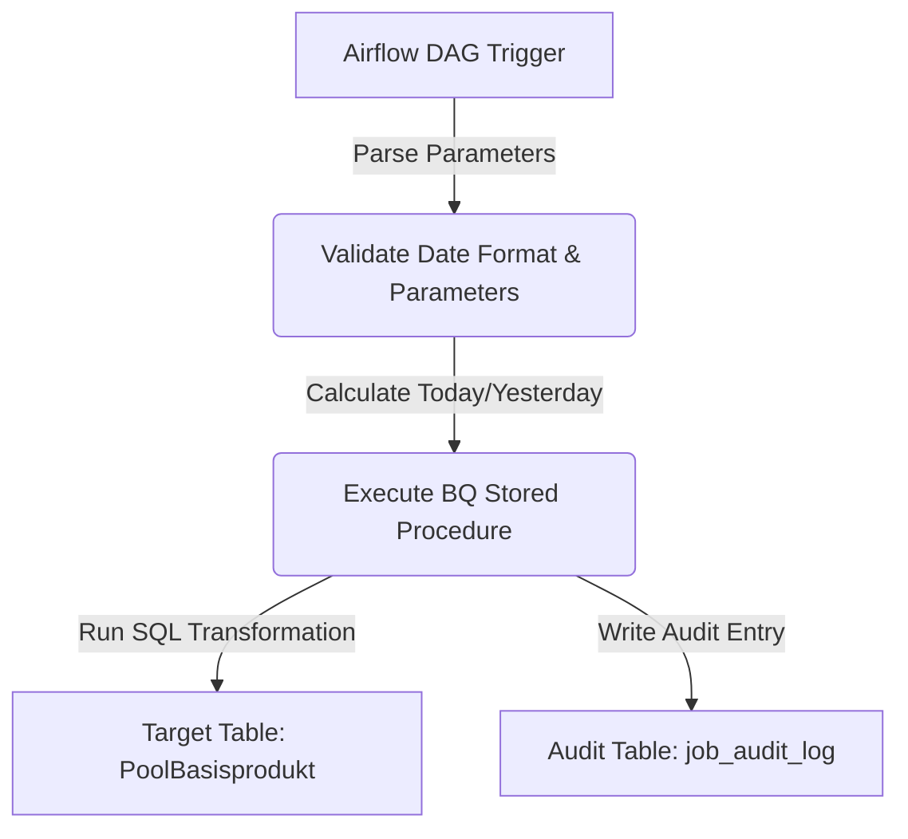

# Migration Design — vobs/dw_source/isrpt/isbert/SQL/aktuell/aufbereitung/bin/k_ausd_bp_ta_cntrct_dist.ksh

## 1. Purpose & Scope
The shell script `k_ausd_bp_ta_cntrct_dist.ksh` is a control and orchestration wrapper (part of the legacy ISBERT data preparation framework) designed to:
1. Parse and validate execution parameters (Job ID, Entry ID, Reporting Date/Stichtag, Restart value).
2. Validate the reporting date (`p_Stichtag`) against the `DDMMYYYY` format.
3. Determine relative dates (today and yesterday) dynamically using the utility `gestern.ksh`.
4. Execute the core Oracle SQL processing script `d_ausd_bp_ta_cntrct_dist.sql` via SQL*Plus, passing the derived dates and execution parameters.
5. Retrieve the processing results (specifically, record count) and log execution details.

**Business Domain**: Business Intelligence / Data Warehousing (ISBERT), specifically dealing with data preparations for basic product transaction accounts and contract distribution datasets (`PoolBasisprodukt`).

---

## 2. Source Inventory
| Source File Path | Technology | Complexity Tier | Automation Bucket | Est. Effort | Notes / Purpose |
| :--- | :--- | :--- | :--- | :--- | :--- |
| `k_ausd_bp_ta_cntrct_dist.ksh` | KornShell (Ksh) / SQL*Plus | Medium | Semi-automated (65% automation) | Medium | Entry point script. Sources standard framework scripts, validates dates/parameters, runs SQL*Plus, and handles logging. |
| *`d_ausd_bp_ta_cntrct_dist.sql`* *(Reference only)* | Oracle SQL | Medium | Semi-automated | Medium | Core processing SQL file executed by the wrapper (detected via lineage analysis). |

---

## 3. Target Architecture
The legacy KornShell orchestration framework will be retired and replaced with **Google Cloud Composer (Apache Airflow)** for workflow orchestration and **BigQuery Stored Procedures** for internal database processing.

### Components
1. **Orchestrator**: **Google Cloud Composer (Apache Airflow)**
   - Manages execution schedules and parameter passing (Job ID, Stichtag).
   - Dynamically calculates context dates (today and yesterday) using Airflow execution macros or Python functions.
2. **Compute & Transformation Engine**: **BigQuery Stored Procedure**
   - The core logic from `d_ausd_bp_ta_cntrct_dist.sql` is migrated to a native BigQuery Stored Procedure: `project.dataset.sp_d_ausd_bp_ta_cntrct_dist`.
   - Date formats and validations are performed directly via BigQuery SQL functions.
3. **Audit/Logging**:
   - Framework utilities (like `FOSJobErzeugeEintrag`) are replaced by an audit log table: `project.dataset.job_audit_log`.

---

## 4. Data Flow & Lineage



### Execution Order
1. **DAG Trigger**: The pipeline starts with input variables: `p_JobKennung`, `p_EintragsNr`, `p_Stichtag`, and `p_wiederanlaufWert`.
2. **Date Computation**:
   - `p_Stichtag` is parsed.
   - `v_datum_heute` and `v_datum_gestern` are derived (replacing `gestern.ksh`).
3. **Execution**: The stored procedure `sp_d_ausd_bp_ta_cntrct_dist` is called.
4. **Data Load**: Transformations run and populate the target datasets.
5. **Auditing**: Execution statistics and status (success/failure) are saved to `job_audit_log`.

---

## 5. Transformation Logic

### Parameter Parsing and Validation
- **Bash Logic**: Checks if mandatory variables (`p_JobKennung`, `p_Stichtag`, `p_EintragsNr`) are set and validates that `$p_Stichtag` conforms to the `DDMMYYYY` format.
- **BigQuery Migration**: Done via stored procedure parameters and standard date validation functions:
  ```sql
  -- Validate date format
  IF SAFE.PARSE_DATE('%d%m%Y', p_Stichtag) IS NULL THEN
    ERROR 'Invalid Stichtag format. Expected DDMMYYYY.';
  END IF;
  ```

### Date Calculations
- **Bash Logic**: Calls `gestern.ksh` to get today's and yesterday's dates as strings.
- **BigQuery Migration**: Calculated relative to the input `p_Stichtag` or system date:
  ```sql
  DECLARE v_stichtag_date DATE;
  DECLARE v_datum_heute DATE;
  DECLARE v_datum_gestern DATE;

  SET v_stichtag_date = PARSE_DATE('%d%m%Y', p_Stichtag);
  SET v_datum_heute = v_stichtag_date;
  SET v_datum_gestern = DATE_SUB(v_stichtag_date, INTERVAL 1 DAY);
  ```

### Commented Post-Processing Code Block
The source script contains commented code blocks performing file manipulations (`sed`, `sort`, `join`) on CSV files (`cibasis_data24.dat`, `cibasis_data96.dat`, `cibasis_fax.dat`). 
- **Design Action**: These operations are inactive in production. If business logic dictates their reinstatement, they should be implemented inside BigQuery as SQL `JOIN` and `ORDER BY` operations over staging tables instead of shell-level operations.

### Job Bookkeeping / Auditing
- **Bash Logic**: Generates an execution record via `FOSJobErzeugeEintrag` using `$v_records` (read from a temp file).
- **BigQuery Migration**:
  ```sql
  -- Log metadata directly to the audit table
  INSERT INTO `project.dataset.job_audit_log` (
    tab_name, status, type_code, stichtag_from, stichtag_to, active_flag, record_count, run_timestamp
  )
  VALUES (
    'PoolBasisprodukt', 'A', 'I', v_stichtag_date, v_stichtag_date, 'N', v_records, CURRENT_TIMESTAMP()
  );
  ```

---

## 6. External Dependencies

| Legacy Dependency | Target Replacement | Implementation Method |
| :--- | :--- | :--- |
| `f_alis_msgerr.ksh` / `h_alis_parameter.ksh` | BigQuery Structured Exceptions / Airflow alerting | `ERROR` / `RAISE USING MESSAGE` constructs in BigQuery; standard Airflow email/Slack alert operators on task failure. |
| `h_alis_date.ksh` / `gestern.ksh` | BigQuery native date functions | Use `PARSE_DATE`, `DATE_SUB`, and `FORMAT_DATE` in SQL. |
| `h_alis_sqlplus.ksh` / SQL*Plus | `BigQueryInsertJobOperator` | Executed directly from Cloud Composer DAG. |
| Temporary File System (`$DW_DIR_UTL`) | BigQuery Variables / Staging Tables | Replace files like `bert_k_ausd_bp_ta_cntrct_dist.tmp` with SQL execution variables (`DECLARE v_records INT64;`). |

---

## 7. Unresolved / Risks

1. **Inner SQL Details Missing**:
   - *Risk*: The code inside `d_ausd_bp_ta_cntrct_dist.sql` is not provided in this package.
   - *Mitigation*: Ensure the Oracle SQL syntax inside `d_ausd_bp_ta_cntrct_dist.sql` is assessed and translated to BigQuery Standard SQL (e.g., removing Oracle hints, migrating Oracle-specific joins `(+)` to standard `LEFT OUTER JOIN`, mapping functions like `NVL` to `COALESCE`, and modifying Oracle partition queries).
2. **Commented File Cleanup**:
   - *Risk*: The commented-out pipeline (`sed/sort/join`) may have hidden dependencies or represents a legacy pipeline that was run manually.
   - *Mitigation*: Confirm with the business that these steps are completely obsolete and can be safely omitted from the migration.

---

## 8. Build Plan

The following artifacts must be developed in the specified sequence:

1. **Database Schema Setup (DDL)**:
   - Create or verify the audit table schema (`job_audit_log`).
   - Create target table schemas (related to `PoolBasisprodukt`).
2. **BigQuery Stored Procedure Development (`sp_d_ausd_bp_ta_cntrct_dist`)**:
   - Migrate and encapsulate the translated SQL script `d_ausd_bp_ta_cntrct_dist.sql` into a Stored Procedure.
   - Embed date calculations, validations, and audit inserts.
3. **Orchestration Workflow (Airflow Python DAG)**:
   - Create `dag_k_ausd_bp_ta_cntrct_dist.py`.
   - Setup DAG params (`p_JobKennung`, `p_EintragsNr`, `p_Stichtag`, `p_wiederanlaufWert`).
   - Use `BigQueryInsertJobOperator` to call the BigQuery stored procedure.