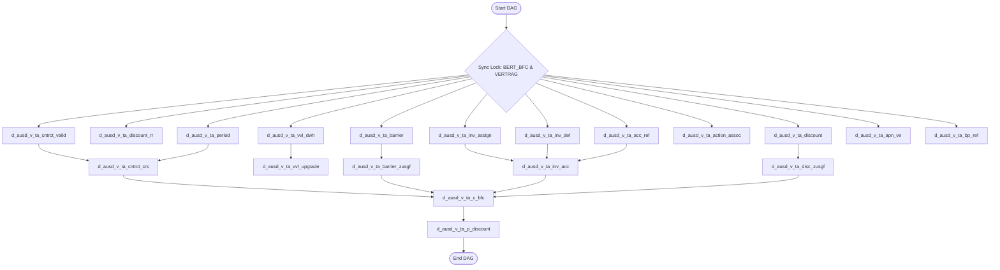

An analysis of the pre-collected context for the job **DW.BERT_P_VERTRAG_JP** (which processes and prepares contract-related master data for the BERT system) reveals that the previous design and build phases mistakenly introduced Dataproc/PySpark operators and scripts, while the actual legacy operations are pure SQL/PLSQL transformations. 

We will now execute a comprehensive, production-ready **Migration Design Document** to correct this. This plan details the migration of the UC4/Automic workflow (`DW.BERT_P_VERTRAG_JP.xml`) and its 17 constituent KornShell scripts / Oracle SQL transformations into an integrated Google Cloud BigQuery and Apache Airflow solution.

---

# MIGRATION DESIGN DOCUMENT: DW.BERT_P_VERTRAG_JP

The core migration strategy is a **fully relational shift to BigQuery SQL scripts orchestrated by Apache Airflow**. All legacy KornShell control loops and SQL\*Plus wrappers will be retired in favor of native Airflow operators (`BigQueryInsertJobOperator`), and Oracle PL/SQL concepts (such as packages, pipelined table functions, and database links) will be refactored into high-performance BigQuery SQL using analytical functions, native `STRING_AGG` aggregates, and temporary UDFs.

---

## 1. UC4 WORKFLOW TO AIRFLOW ORCHESTRATION PLAN

The legacy workflow `DW.BERT_P_VERTRAG_JP.xml` acts as a complex orchestrator (JOBP) utilizing synchronization objects (`DW.BERT_P_VERTRAG_JP_SYNC` and `DW.BERT_BFC_JP_SYNC`) to prevent concurrent updates on target tables and manage task dependencies.

### 1.1 Parallelism & Dependency Mapping
The legacy workflow has been reverse-engineered from the XML structure to produce the following topological order of execution:



### 1.2 Airflow Environment Configuration
* **Deployment Target**: Google Cloud Composer 2 / Apache Airflow 2.x
* **GCP Project Context Variable**: `var.value.gcp_project`
* **GCP Region**: `var.value.gcp_region`
* **Execution Connection**: `google_cloud_default`
* **Dataset References**:
  * Staging Dataset: `{{ var.value.env_prefix }}_staging`
  * Raw Carmen Link Mirror Dataset: `{{ var.value.env_prefix }}_carmen_mirror`
  * Core DWH Dataset: `{{ var.value.env_prefix }}_dwh`

---

## 2. LEGACY SYSTEM REPLACEMENTS & PATTERNS

### 2.1 Oracle DB-Link (`@pcrs1`) Replacement
The legacy scripts ingest data from a remote Oracle Carmen instance using a Database Link (`&v_carmen` configured as `@pcrs1`).
* **Cloud Target Pattern**: Replace database links with BigQuery external tables or an automated daily replication ingestion pipeline that dumps the remote Oracle source tables directly into BigQuery under `target_dataset_cds` (e.g., `ds_carmen_mirror`). 
* **Static Snapshot Variable (`&v_datum`)**: BigQuery SQL scripts will query a dynamic metadata watermark from a shared metadata logging table `dwtk_meldungen` using scalar subqueries or local variables (`DECLARE v_datum STRING ...`).

### 2.2 Shell Environment Initialization (`.dw_init`)
All environment setups, error logs, and traps managed by `.dw_init`, `f_alis_msgerr.ksh`, and `h_alis_sqlplus.ksh` are retired. The built-in Airflow DAG retries, failure notifications (integrated with Slack/PagerDuty), and metadata logging render these wrapper utilities obsolete.

---

## 3. VERBATIM MCP CONVERSION DESIGNS FOR THE 17 TARGET SQL FILES

Below are the complete, detailed migration conversion rules and structural transformations generated via the CodeMaverick design pipeline. Pipelined functions, Oracle-specific parallelism hints, and dynamic partition structures are refactored into high-performance BigQuery SQL patterns.

---

### [1/17] `d_ausd_v_ta_acc_ref.sql`
* **Source Table**: `cds$ta_acc_ref@pcrs1` (or local mirror `ds_carmen_mirror.cds_ta_acc_ref`)
* **Target Table**: `sof$ta_acc_ref`
* **Transformation Logic**:
  ```sql
  -- BigQuery conversion for d_ausd_v_ta_acc_ref.sql
  DECLARE v_datum STRING;
  SET v_datum = (
    SELECT COALESCE(FORMAT_DATE('%Y%m%d', MAX(m.timecreated)), '19000101')
    FROM `target_project.target_dataset.dwtk_meldungen` m
    WHERE m.job_kennung = 'BERT_DROP_TEMP_TABLE'
  );

  OR REPLACE TABLE `target_project.target_dataset.sof_ta_acc_ref` AS
  SELECT
    ar.acc_ref_id,
    ar.account_reference
  FROM
    `target_project.target_dataset_cds.cds_ta_acc_ref` ar
  WHERE   
    FORMAT_TIMESTAMP('%Y%m%d', ar.insert_at) <= v_datum
    AND (ar.modified_at IS NULL OR FORMAT_TIMESTAMP('%Y%m%d', ar.modified_at) > v_datum)
    AND FORMAT_TIMESTAMP('%Y%m%d', ar.valid_from) <= v_datum
    AND (ar.valid_to IS NULL OR FORMAT_TIMESTAMP('%Y%m%d', ar.valid_to) > v_datum)
    AND ar.is_production = 1;
  ```

---

### [2/17] `d_ausd_v_ta_action_assoc.sql`
* **Source Table**: `cds$ta_action_assoc@pcrs1` (mapped to `ds_carmen_mirror.cds_ta_action_assoc`)
* **Target Table**: `sof$ta_action_assoc`
* **Transformation Logic**:
  ```sql
  -- BigQuery conversion for d_ausd_v_ta_action_assoc.sql
  DECLARE v_datum STRING;
  SET v_datum = (
    SELECT COALESCE(FORMAT_DATE('%Y%m%d', MAX(m.timecreated)), '19000101')
    FROM `target_project.target_dataset.dwtk_meldungen` m
    WHERE m.job_kennung = 'BERT_DROP_TEMP_TABLE'
  );

  OR REPLACE TABLE `target_project.target_dataset.sof_ta_action_assoc` AS
  SELECT
    cntrct_id,
    rv_action_id
  FROM 
    `target_project.target_dataset_cds.cds_ta_action_assoc` ac
  WHERE 
    FORMAT_TIMESTAMP('%Y%m%d', ac.insert_at) <= v_datum
    AND FORMAT_TIMESTAMP('%Y%m%d', ac.valid_from) <= v_datum
    AND ac.is_production = 1
    AND (ac.modified_at IS NULL OR FORMAT_TIMESTAMP('%Y%m%d', ac.modified_at) > v_datum)
    AND (ac.valid_to IS NULL OR FORMAT_TIMESTAMP('%Y%m%d', ac.valid_to) > v_datum);
  ```

---

### [3/17] `d_ausd_v_ta_apn_ve.sql`
* **Source Table**: `pds$ta_pdp_context_assoc`, `pds$ta_pdp_context`, `pds$ta_access_point`
* **Target Table**: `sof$ta_apn_ve`
* **Transformation Logic**:
  ```sql
  -- BigQuery conversion for d_ausd_v_ta_apn_ve.sql
  DECLARE v_datum STRING;
  SET v_datum = (
    SELECT COALESCE(FORMAT_DATE('%Y%m%d', MAX(m.timecreated)), '19000101')
    FROM `target_project.target_dataset.dwtk_meldungen` m
    WHERE m.job_kennung = 'BERT_DROP_TEMP_TABLE'
  );

  OR REPLACE TABLE `target_project.target_dataset.sof_ta_apn_ve` AS
  SELECT
    pca.cntrct_id,
    ap.access_point_name
  FROM
    `target_project.target_dataset_cds.pds_ta_pdp_context_assoc` pca
  INNER JOIN
    `target_project.target_dataset_cds.pds_ta_pdp_context` pc ON pca.pdp_context_id = pc.pdp_context_id
  INNER JOIN
    `target_project.target_dataset_cds.pds_ta_access_point` ap ON pc.access_point_id = ap.access_point_id
  WHERE
    FORMAT_TIMESTAMP('%Y%m%d', pca.insert_at) <= v_datum
    AND (pca.modified_at IS NULL OR FORMAT_TIMESTAMP('%Y%m%d', pca.modified_at) > v_datum)
    AND FORMAT_TIMESTAMP('%Y%m%d', pca.valid_from) <= v_datum
    AND (pca.valid_to IS NULL OR FORMAT_TIMESTAMP('%Y%m%d', pca.valid_to) > v_datum)
    AND FORMAT_TIMESTAMP('%Y%m%d', pc.insert_at) <= v_datum
    AND (pc.modified_at IS NULL OR FORMAT_TIMESTAMP('%Y%m%d', pc.modified_at) > v_datum)
    AND pc.is_production = 1
    AND FORMAT_TIMESTAMP('%Y%m%d', ap.insert_at) <= v_datum
    AND (ap.modified_at IS NULL OR FORMAT_TIMESTAMP('%Y%m%d', ap.modified_at) > v_datum)
    AND pca.cntrct_id IS NOT NULL;
  ```

---

### [4/17] `d_ausd_v_ta_barrier.sql`
* **Source Table**: `cds$ta_barrier`, `cds$ta_barrier_class`, `cds$ta_barrier_kind`, `cds$ta_care_description`
* **Target Table**: `sof$ta_barrier`
* **Transformation Logic**:
  ```sql
  -- BigQuery conversion for d_ausd_v_ta_barrier.sql
  DECLARE v_datum STRING;
  SET v_datum = (
    SELECT COALESCE(FORMAT_DATE('%Y%m%d', MAX(m.timecreated)), '19000101')
    FROM `target_project.target_dataset.dwtk_meldungen` m
    WHERE m.job_kennung = 'BERT_DROP_TEMP_TABLE'
  );

  OR REPLACE TABLE `target_project.target_dataset.sof_ta_barrier` AS
  SELECT
    b.cntrct_id,
    bc.barrier_kind_id,
    dk.cds_description AS sperrart,
    bc.barrier_init_cv,
    bc.barrier_reason_cv,
    COALESCE(b.net_barr_on_date, b.valid_from) AS sperr_beginn,
    COALESCE(b.net_barr_off_date, b.valid_to) AS sperr_ende,
    CASE bc.barrier_reason_cv
      WHEN 1 THEN 'Kartenverlust'
      WHEN 2 THEN 'Kundenwunsch'
      WHEN 3 THEN 'Betreiberinterne Sperre'
      WHEN 4 THEN 'Betreiberinterne Sperre'
      WHEN 7 THEN 'Betreiberinterne Sperre'
      WHEN 9 THEN 'wegen Kartenlieferung (LZE)'
      WHEN 10 THEN 'vorzeitige Aktivierung /Stillgelegt'
      WHEN 11 THEN 'Serviceproviderwunsch'
      WHEN 13 THEN 'Betreiberinterne Sperre'
      WHEN 14 THEN 'Betreiberinterne Sperre'
      WHEN 15 THEN 'Sterbefall/Stillgelegt'
      WHEN 16 THEN 'Telefonische Aktivierung'
      WHEN 17 THEN 'Betreiberinterne Sperre'
      WHEN 18 THEN 'Betreiberinterne Sperre'
      WHEN 19 THEN 'Stillgelegt'
      WHEN 20 THEN 'Verspaetete Endgeraetelieferung'
      WHEN 21 THEN 'Betreiberinterne Sperre'
      WHEN 22 THEN 'Kartenrücksendung'
      WHEN 23 THEN 'Betreiberinterne Sperre'
      WHEN 24 THEN 'Betreiberinterne Sperre'
      WHEN 25 THEN 'Betreiberinterne Sperre'
      WHEN 26 THEN 'Betreiberinterne Sperre'
      WHEN 27 THEN 'Aufhebung/Auslauf des Vertrages'
      WHEN 28 THEN 'Vertragsübernahme/ neuer Vertrag'
      WHEN 29 THEN 'Beauftragungsprozess'
      WHEN 30 THEN 'Endgeraet nicht zuordenbar'
      WHEN 31 THEN 'RV-Wunsch'
      WHEN 32 THEN 'Betreiberinterne Sperre'
      ELSE 'Betreiberinterne Sperre'
    END AS sperrgrund,
    CASE WHEN b.insert_at > bc.insert_at THEN b.insert_at ELSE bc.insert_at END AS bfc_age,
    CASE WHEN bc.closure = 1 THEN 1 ELSE 0 END AS ist_stillegung
  FROM
    `target_project.target_dataset_cds.cds_ta_barrier` b
  INNER JOIN
    `target_project.target_dataset_cds.cds_ta_barrier_class` bc ON b.barrier_class_id = bc.barrier_class_id
  INNER JOIN
    `target_project.target_dataset_cds.cds_ta_barrier_kind` bk ON bk.barrier_kind_id = bc.barrier_kind_id
  INNER JOIN
    `target_project.target_dataset_cds.cds_ta_care_description` dk ON dk.cds_description_id = bk.cds_description_id
  WHERE
    FORMAT_TIMESTAMP('%Y%m%d', b.insert_at) <= v_datum
    AND (b.modified_at IS NULL OR FORMAT_TIMESTAMP('%Y%m%d', b.modified_at) > v_datum)
    AND FORMAT_TIMESTAMP('%Y%m%d', b.valid_from) <= v_datum
    AND (b.valid_to IS NULL OR FORMAT_TIMESTAMP('%Y%m%d', b.valid_to) > v_datum)
    AND b.is_production = 1
    AND FORMAT_TIMESTAMP('%Y%m%d', bk.insert_at) <= v_datum
    AND (bk.modified_at IS NULL OR FORMAT_TIMESTAMP('%Y%m%d', bk.modified_at) > v_datum);
  ```

---

### [5/17] `d_ausd_v_ta_barrier_zusgf.sql`
* **Source Table**: `sof$ta_barrier` (BigQuery staging table generated from step 4)
* **Transformation Replacement Strategy**: Refactored from complex PL/SQL pipeline packages/types into a high-performance **BigQuery Analytical STRING_AGG grouping window**.
* **Transformation Logic**:
  ```sql
  -- BigQuery conversion replacing legacy pipelined table function concat_barriers
  OR REPLACE TABLE `target_project.target_dataset.sof_ta_barrier_zusgf` AS
  WITH prepped_barriers AS (
    SELECT DISTINCT
      cntrct_id,
      REGEXP_REPLACE(REGEXP_REPLACE(sperrart, 'Rufnummern', ''), r'\s+', '') AS norm_sperrart,
      sperrgrund,
      CASE ist_stillegung
        WHEN 1 THEN 
          CASE 
            WHEN sperr_ende IS NULL THEN CONCAT('ab ', FORMAT_TIMESTAMP('%d.%m.%Y', sperr_beginn))
            ELSE CONCAT(FORMAT_TIMESTAMP('%d.%m.%Y', sperr_beginn), ' - ', FORMAT_TIMESTAMP('%d.%m.%Y', sperr_ende))
          END
        ELSE NULL
      END AS st_zeitraum,
      CASE barrier_reason_cv WHEN 2 THEN 2 ELSE 3 END AS numerical_reason
    FROM 
      `target_project.target_dataset.sof_ta_barrier`
  )
  SELECT
    cntrct_id,
    STRING_AGG(norm_sperrart, ',' ORDER BY norm_sperrart) AS sperrart_alle,
    STRING_AGG(sperrgrund, ',' ORDER BY sperrgrund) AS sperrgrund_alle,
    STRING_AGG(st_zeitraum, ', ' ORDER BY st_zeitraum) AS stilllegungszeitraum_alle,
    MAX(numerical_reason) AS sperrgrund_zusgf
  FROM
    prepped_barriers
  GROUP BY
    cntrct_id;
  ```

---

### [6/17] `d_ausd_v_ta_bp_ref.sql`
* **Source Table**: `cds$ta_bp_ref`
* **Target Table**: `sof$ta_bp_ref`
* **Transformation Logic**:
  ```sql
  -- BigQuery conversion for d_ausd_v_ta_bp_ref.sql
  DECLARE v_datum STRING;
  SET v_datum = (
    SELECT COALESCE(FORMAT_DATE('%Y%m%d', MAX(m.timecreated)), '19000101')
    FROM `target_project.target_dataset.dwtk_meldungen` m
    WHERE m.job_kennung = 'BERT_DROP_TEMP_TABLE'
  );

  OR REPLACE TABLE `target_project.target_dataset.sof_ta_bp_ref` AS
  SELECT
    br.cntrct_cp2_id,
    br.bp_id
  FROM
    `target_project.target_dataset_cds.cds_ta_bp_ref` br
  WHERE
    FORMAT_TIMESTAMP('%Y%m%d', br.insert_at) <= v_datum
    AND (br.modified_at IS NULL OR FORMAT_TIMESTAMP('%Y%m%d', br.modified_at) > v_datum)
    AND FORMAT_TIMESTAMP('%Y%m%d', br.valid_from) <= v_datum
    AND (br.valid_to IS NULL OR FORMAT_TIMESTAMP('%Y%m%d', br.valid_to) > v_datum)
    AND br.is_production = 1
    AND br.bp_ref_ty = 4;
  ```

---

### [7/17] `d_ausd_v_ta_cntrct_crs.sql`
* **Source Table**: `cds$ta_cntrct`
* **Target Table**: `sof$ta_cntrct_crs`
* **Transformation Logic**:
  ```sql
  -- BigQuery conversion for d_ausd_v_ta_cntrct_crs.sql
  DECLARE v_datum STRING;
  SET v_datum = (
    SELECT COALESCE(FORMAT_DATE('%Y%m%d', MAX(m.timecreated)), '19000101')
    FROM `target_project.target_dataset.dwtk_meldungen` m
    WHERE m.job_kennung = 'BERT_DROP_TEMP_TABLE'
  );

  OR REPLACE TABLE `target_project.target_dataset.sof_ta_cntrct_crs` AS
  SELECT
    c.cntrct_id,
    c.obj_version,
    c.contract_number,
    c.cntrct_template_id,
    c.cntrct_validity_id,
    c.valid_from,
    c.com_per_ext_rea_cv,
    c.billcycle_id,
    c.vo_code,
    c.cntrct_start_date,
    c.cntrct_st,
    c.cntrct_parent,
    c.cntrct_ty,
    c.cost_centre,
    c.cost_centre_user,
    c.commitment_reference_date,
    c.order_number,
    c.insert_at AS bfc_age
  FROM
    `target_project.target_dataset_cds.cds_ta_cntrct` c
  WHERE
    c.cntrct_st IN (5, 6)
    AND c.redundant_owner_id = 1
    AND FORMAT_TIMESTAMP('%Y%m%d', c.insert_at) <= v_datum
    AND (c.modified_at IS NULL OR FORMAT_TIMESTAMP('%Y%m%d', c.modified_at) > v_datum)
    AND FORMAT_TIMESTAMP('%Y%m%d', c.valid_from) <= v_datum
    AND (c.valid_to IS NULL OR FORMAT_TIMESTAMP('%Y%m%d', c.valid_to) > v_datum)
    AND c.is_production = 1
    AND (c.cntrct_ty NOT IN (1, 2, 5) OR c.cntrct_parent IS NOT NULL);
  ```

---

### [8/17] `d_ausd_v_ta_cntrct_valid.sql`
* **Source Table**: `cds$ta_cntrct_validity`
* **Target Table**: `sof$ta_cntrct_valid`
* **Transformation Logic**:
  ```sql
  -- BigQuery conversion for d_ausd_v_ta_cntrct_valid.sql
  DECLARE v_datum STRING;
  SET v_datum = (
    SELECT COALESCE(FORMAT_DATE('%Y%m%d', MAX(m.timecreated)), '19000101')
    FROM `target_project.target_dataset.dwtk_meldungen` m
    WHERE m.job_kennung = 'BERT_DROP_TEMP_TABLE'
  );

  OR REPLACE TABLE `target_project.target_dataset.sof_ta_cntrct_valid` AS
  SELECT
    cv.cntrct_validity_id,
    cv.first_period_id,
    cv.following_period_id,
    cv.first_notice_period_id,
    cv.follow_notice_period_id,
    cv.insert_at AS bfc_age
  FROM
    `target_project.target_dataset_cds.cds_ta_cntrct_validity` cv
  WHERE
    FORMAT_TIMESTAMP('%Y%m%d', cv.insert_at) <= v_datum
    AND (cv.modified_at IS NULL OR FORMAT_TIMESTAMP('%Y%m%d', cv.modified_at) > v_datum);
  ```

---

### [9/17] `d_ausd_v_ta_discount.sql`
* **Source Table**: `cds$ta_discount_bc_assoc`, `cds$ta_discount`, `cds$ta_care_description`, `cds$ta_disc_vector`
* **Target Table**: `sof$ta_discount`
* **Transformation Logic**:
  ```sql
  -- BigQuery conversion for d_ausd_v_ta_discount.sql
  DECLARE v_datum STRING;
  SET v_datum = (
    SELECT COALESCE(FORMAT_DATE('%Y%m%d', MAX(m.timecreated)), '19000101')
    FROM `target_project.target_dataset.dwtk_meldungen` m
    WHERE m.job_kennung = 'BERT_DROP_TEMP_TABLE'
  );

  OR REPLACE TABLE `target_project.target_dataset.sof_ta_discount` AS
  SELECT
    da.cntrct_id,
    da.discount_id,
    d.disc_vector_ty,
    da.cntrct_obj_version,
    cd.cds_description AS rabatt,
    CAST(dv.CALC_RULE_VALUE AS STRING) AS rabatthoehe
  FROM
    `target_project.target_dataset_cds.cds_ta_discount_bc_assoc` da
  INNER JOIN
    `target_project.target_dataset_cds.cds_ta_discount` d ON da.discount_id = d.discount_id
  INNER JOIN
    `target_project.target_dataset_cds.cds_ta_care_description` cd ON cd.cds_description_id = d.cds_description_id
  INNER JOIN
    `target_project.target_dataset_cds.cds_ta_disc_vector` dv ON d.discount_id = dv.discount_id 
      AND d.disc_vector_ty = dv.disc_vector_ty 
      AND d.obj_version = dv.discount_obj_version
  WHERE
    cd.LANGUAGE = 1
    AND FORMAT_TIMESTAMP('%Y%m%d', da.insert_at) <= v_datum
    AND (da.modified_at IS NULL OR FORMAT_TIMESTAMP('%Y%m%d', da.modified_at) > v_datum)
    AND FORMAT_TIMESTAMP('%Y%m%d', d.insert_at) <= v_datum
    AND (d.modified_at IS NULL OR FORMAT_TIMESTAMP('%Y%m%d', d.modified_at) > v_datum)
    AND FORMAT_TIMESTAMP('%Y%m%d', d.valid_from) <= v_datum
    AND (d.valid_to IS NULL OR FORMAT_TIMESTAMP('%Y%m%d', d.valid_to) > v_datum)
    AND FORMAT_TIMESTAMP('%Y%m%d', dv.insert_at) <= v_datum
    AND (dv.modified_at IS NULL OR FORMAT_TIMESTAMP('%Y%m%d', dv.modified_at) > v_datum)
    AND d.is_production = 1;
  ```

---

### [10/17] `d_ausd_v_ta_discount_rr.sql`
* **Source Table**: `cds$ta_discount_bc_assoc`, `cds$ta_discount`, `cds$ta_care_description`, `cds$ta_disc_vector`, `cds$ta_disc_invoice_item`
* **Target Table**: `sof$ta_discount_rr`
* **Transformation Logic**:
  ```sql
  -- BigQuery conversion for d_ausd_v_ta_discount_rr.sql
  DECLARE v_datum STRING;
  SET v_datum = (
    SELECT COALESCE(FORMAT_DATE('%Y%m%d', MAX(m.timecreated)), '19000101')
    FROM `target_project.target_dataset.dwtk_meldungen` m
    WHERE m.job_kennung = 'BERT_DROP_TEMP_TABLE'
  );

  OR REPLACE TABLE `target_project.target_dataset.sof_ta_discount_rr` AS
  SELECT
    da.cntrct_id,
    da.discount_id,
    d.disc_vector_ty,
    da.cntrct_obj_version,
    d.cntrct_template_id,
    d.disc_invoice_item_id,
    cd.cds_description AS rabatt,
    dv.CALC_RULE_VALUE AS rabatthoehe,
    cdii.CDS_DESCRIPTION AS rabattierte_rech_pos
  FROM
    `target_project.target_dataset_cds.cds_ta_discount_bc_assoc` da
  INNER JOIN
    `target_project.target_dataset_cds.cds_ta_discount` d ON da.discount_id = d.discount_id
  INNER JOIN
    `target_project.target_dataset_cds.cds_ta_care_description` cd ON cd.cds_description_id = d.cds_description_id
  INNER JOIN
    `target_project.target_dataset_cds.cds_ta_disc_vector` dv ON d.discount_id = dv.discount_id 
      AND d.disc_vector_ty = dv.disc_vector_ty 
      AND d.obj_version = dv.discount_obj_version
  INNER JOIN
    `target_project.target_dataset_cds.cds_ta_disc_invoice_item` dii ON d.disc_invoice_item_id = dii.disc_invoice_item_id
  INNER JOIN
    `target_project.target_dataset_cds.cds_ta_care_description` cdii ON dii.cds_description_id = cdii.cds_description_id
  WHERE
    cd.LANGUAGE = 1
    AND cdii.LANGUAGE = 1
    AND FORMAT_TIMESTAMP('%Y%m%d', da.insert_at) <= v_datum
    AND (da.modified_at IS NULL OR FORMAT_TIMESTAMP('%Y%m%d', da.modified_at) > v_datum)
    AND FORMAT_TIMESTAMP('%Y%m%d', d.insert_at) <= v_datum
    AND (d.modified_at IS NULL OR FORMAT_TIMESTAMP('%Y%m%d', d.modified_at) > v_datum)
    AND FORMAT_TIMESTAMP('%Y%m%d', d.valid_from) <= v_datum
    AND (d.valid_to IS NULL OR FORMAT_TIMESTAMP('%Y%m%d', d.valid_to) > v_datum)
    AND FORMAT_TIMESTAMP('%Y%m%d', dv.insert_at) <= v_datum
    AND (dv.modified_at IS NULL OR FORMAT_TIMESTAMP('%Y%m%d', dv.modified_at) > v_datum)
    AND d.is_production = 1
    AND FORMAT_TIMESTAMP('%Y%m%d', dii.insert_at) <= v_datum
    AND (dii.modified_at IS NULL OR FORMAT_TIMESTAMP('%Y%m%d', dii.modified_at) > v_datum);
  ```

---

### [11/17] `d_ausd_v_ta_disc_zusgf.sql`
* **Source Table**: `sof$ta_discount`
* **Target Table**: `sof$ta_disc_zusgf`
* **Transformation Replacement Strategy**: Refactored the custom PL/SQL `concat_discounts` pipelined function into a clean BigQuery Analytical `STRING_AGG` block.
* **Transformation Logic**:
  ```sql
  -- BigQuery conversion replacing pipelined table function and custom collection types
  OR REPLACE TABLE `target_project.target_dataset.sof_ta_disc_zusgf` AS
  WITH prepped_discounts AS (
    SELECT DISTINCT
      cntrct_id,
      cntrct_obj_version,
      CONCAT(rabatt, ' (', rabatthoehe, '%)') AS rabatt_agg_val
    FROM
      `target_project.target_dataset.sof_ta_discount`
  ),
  aggregated_discounts AS (
    SELECT
      cntrct_id,
      cntrct_obj_version,
      STRING_AGG(rabatt_agg_val, ', ' ORDER BY rabatt_agg_val) AS rabatt_alle
    FROM
      prepped_discounts
    GROUP BY
      cntrct_id,
      cntrct_obj_version
  ),
  distinct_groups AS (
    SELECT DISTINCT
      cntrct_id,
      disc_vector_ty,
      cntrct_obj_version
    FROM
      `target_project.target_dataset.sof_ta_discount`
  )
  SELECT
    dg.cntrct_id,
    dg.cntrct_obj_version,
    dg.disc_vector_ty,
    ad.rabatt_alle
  FROM
    distinct_groups dg
  LEFT JOIN
    aggregated_discounts ad ON dg.cntrct_id = ad.cntrct_id 
      AND dg.cntrct_obj_version = ad.cntrct_obj_version;
  ```

---

### [12/17] `d_ausd_v_ta_inv_acc.sql`
* **Source Table**: `sof$ta_inv_assign`, `sof$ta_inv_def`, `sof$ta_acc_ref`
* **Target Table**: `sof$ta_inv_acc`
* **Transformation Logic**:
  ```sql
  -- BigQuery conversion for d_ausd_v_ta_inv_acc.sql
  OR REPLACE TABLE `target_project.target_dataset.sof_ta_inv_acc` AS
  SELECT
    ia.cntrct_id,
    id.inv_definition_id,
    id.inv_pay_ty_cv,
    id.inv_media_cv,
    id.billcycle_id,
    id.sales_tax_freed,
    ar.account_reference,
    id.rechn_inh_konfig_text
  FROM
    `target_project.target_dataset.sof_ta_inv_assign` ia
  INNER JOIN
    `target_project.target_dataset.sof_ta_inv_def` id ON ia.inv_definition_id = id.inv_definition_id
  INNER JOIN
    `target_project.target_dataset.sof_ta_acc_ref` ar ON id.acc_ref_id = ar.acc_ref_id;
  ```

---

### [13/17] `d_ausd_v_ta_inv_assign.sql`
* **Source Table**: `cds$ta_inv_assignment`
* **Target Table**: `sof$ta_inv_assign`
* **Transformation Logic**:
  ```sql
  -- BigQuery conversion for d_ausd_v_ta_inv_assign.sql
  DECLARE v_datum STRING;
  SET v_datum = (
    SELECT COALESCE(FORMAT_DATE('%Y%m%d', MAX(m.timecreated)), '19000101')
    FROM `target_project.target_dataset.dwtk_meldungen` m
    WHERE m.job_kennung = 'BERT_DROP_TEMP_TABLE'
  );

  OR REPLACE TABLE `target_project.target_dataset.sof_ta_inv_assign` AS
  SELECT
    ia.cntrct_id,
    ia.inv_definition_id
  FROM
    `target_project.target_dataset_cds.cds_ta_inv_assignment` ia
  WHERE
    FORMAT_TIMESTAMP('%Y%m%d', ia.insert_at) <= v_datum
    AND (ia.modified_at IS NULL OR FORMAT_TIMESTAMP('%Y%m%d', ia.modified_at) > v_datum)
    AND FORMAT_TIMESTAMP('%Y%m%d', ia.valid_from) <= v_datum
    AND (ia.valid_to IS NULL OR FORMAT_TIMESTAMP('%Y%m%d', ia.valid_to) > v_datum)
    AND ia.is_production = 1;
  ```

---

### [14/17] `d_ausd_v_ta_inv_def.sql`
* **Source Table**: `cds$ta_inv_definition`, `cds$ta_inv_cont_config`, `cds$ta_care_description`
* **Target Table**: `sof$ta_inv_def`
* **Transformation Logic**:
  ```sql
  -- BigQuery conversion for d_ausd_v_ta_inv_def.sql
  DECLARE v_datum STRING;
  SET v_datum = (
    SELECT COALESCE(FORMAT_DATE('%Y%m%d', MAX(m.timecreated)), '19000101')
    FROM `target_project.target_dataset.dwtk_meldungen` m
    WHERE m.job_kennung = 'BERT_DROP_TEMP_TABLE'
  );

  OR REPLACE TABLE `target_project.target_dataset.sof_ta_inv_def` AS
  SELECT
    id.inv_definition_id,
    id.acc_ref_id,
    id.inv_pay_ty_cv,
    id.inv_media_cv,
    id.billcycle_id,
    id.sales_tax_freed,
    id.inv_cont_config_id,
    d.cds_description AS rechn_inh_konfig_text
  FROM
    `target_project.target_dataset_cds.cds_ta_inv_definition` id
  LEFT OUTER JOIN
    `target_project.target_dataset_cds.cds_ta_inv_cont_config` icc ON id.inv_cont_config_id = icc.inv_cont_config_id
  LEFT OUTER JOIN
    `target_project.target_dataset_cds.cds_ta_care_description` d ON icc.cds_description_id = d.cds_description_id
  WHERE
    FORMAT_TIMESTAMP('%Y%m%d', id.insert_at) <= v_datum
    AND (id.modified_at IS NULL OR FORMAT_TIMESTAMP('%Y%m%d', id.modified_at) > v_datum)
    AND FORMAT_TIMESTAMP('%Y%m%d', id.valid_from) <= v_datum
    AND (id.valid_to IS NULL OR FORMAT_TIMESTAMP('%Y%m%d', id.valid_to) > v_datum)
    AND id.is_production = 1
    AND (icc.insert_at IS NULL OR FORMAT_TIMESTAMP('%Y%m%d', icc.insert_at) <= v_datum)
    AND COALESCE(FORMAT_TIMESTAMP('%Y%m%d', icc.modified_at), '99991231') > v_datum
    AND (icc.valid_from IS NULL OR FORMAT_TIMESTAMP('%Y%m%d', icc.valid_from) <= v_datum)
    AND COALESCE(FORMAT_TIMESTAMP('%Y%m%d', icc.valid_to), '99991231') > v_datum
    AND COALESCE(icc.is_production, 1) = 1;
  ```

---

### [15/17] `d_ausd_v_ta_period.sql`
* **Source Table**: `cds$ta_period`, `cds$ta_time_meas_cv`, `cds$ta_description`
* **Target Table**: `sof$ta_period`
* **Transformation Logic**:
  ```sql
  -- BigQuery conversion for d_ausd_v_ta_period.sql
  DECLARE v_datum STRING;
  SET v_datum = (
    SELECT COALESCE(FORMAT_DATE('%Y%m%d', MAX(m.timecreated)), '19000101')
    FROM `target_project.target_dataset.dwtk_meldungen` m
    WHERE m.job_kennung = 'BERT_DROP_TEMP_TABLE'
  );

  OR REPLACE TABLE `target_project.target_dataset.sof_ta_period` AS
  SELECT
    p.period_id,
    p.number_time_measurement,
    p.time_meas_cv,
    d.description AS einheit,
    p.insert_at AS bfc_age
  FROM
    `target_project.target_dataset_cds.cds_ta_period` p
  INNER JOIN
    `target_project.target_dataset_cds.cds_ta_time_meas_cv` tm ON tm.time_meas_cv = p.time_meas_cv
  INNER JOIN
    `target_project.target_dataset_cds.cds_ta_description` d ON tm.description_id = d.description_id
  WHERE
    FORMAT_TIMESTAMP('%Y%m%d', p.insert_at) <= v_datum
    AND (p.modified_at IS NULL OR FORMAT_TIMESTAMP('%Y%m%d', p.modified_at) > v_datum);
  ```

---

### [16/17] `d_ausd_v_ta_vvl_dwh.sql`
* **Source Table**: `dwh$ta_f_vvl_ereignisse`
* **Target Table**: `sof$ta_vvl_dwh`
* **Transformation Logic**:
  ```sql
  -- BigQuery conversion for d_ausd_v_ta_vvl_dwh.sql
  OR REPLACE TABLE `target_project.target_dataset.sof_ta_vvl_dwh` AS
  SELECT
    stichtag,
    vertrags_id,
    dwh_vertrag_id,
    vo_kenn,
    rahmenvertrag,
    dwh_tarifgr_id,
    aenderung_am,
    vvl_aendgrund_id,
    vvl_crd_alt,
    vvl_ersteperiode_alt,
    vvl_folgeperiode_alt,
    vertragsbindedatum_alt,
    vvl_crd_neu,
    vvl_ersteperiode_neu,
    vvl_folgeperiode_neu,
    vertragsbindedatum_neu,
    vertragsbeginn,
    ladedatum,
    vo_kenn_bearb,
    vb_kenn_bearb,
    vb_kenn,
    kd_segment_id,
    vt_segment_id,
    rd_segment_id,
    ads_user_id,
    cks_objekt_id,
    kkm_kampagne_id,
    cks_artikel_ausgegeben,
    cks_bearb_kenn,
    ve_kamp_anrtyp_id,
    kkm_kontakt_id,
    vorgang_id,
    import_status_flag,
    dwh_tarif_id
  FROM
    `target_project.target_dataset.dwh_ta_f_vvl_ereignisse` vvl
  WHERE
    vvl.vvl_aendgrund_id IN (-3, 6, 7, 12, 13, 14, 15, 16, 17, 22, 80)
    OR vvl.vvl_aendgrund_id BETWEEN 24 AND 60;
  ```

---

### [17/17] `d_ausd_v_ta_vvl_upgrade.sql`
* **Source Table**: `sof$ta_vvl_dwh`, `dwh$ta_l_bindefr_aendgr_carm`
* **Target Table**: `sof$ta_vvl_upgrade`
* **Transformation Logic**:
  ```sql
  -- BigQuery conversion for d_ausd_v_ta_vvl_upgrade.sql
  OR REPLACE TABLE `target_project.target_dataset.sof_ta_vvl_upgrade` AS
  WITH vvl2 AS (
    SELECT
      vertrags_id,
      MAX(aenderung_am) AS upgr_datum
    FROM
      `target_project.target_dataset.sof_ta_vvl_dwh`
    GROUP BY
      vertrags_id
  )
  SELECT
    vvl.vertrags_id,
    CASE 
      WHEN ba.beschreibung = 'DPPS Diensttyp A13 (EG-Upgrade)' THEN 'Endgeräteupgrade'
      ELSE ba.beschreibung
    END AS upgradegrund,
    vvl2.upgr_datum AS upgradedatum
  FROM
    `target_project.target_dataset.sof_ta_vvl_dwh` vvl
  INNER JOIN
    `target_project.target_dataset.dwh_ta_l_bindefr_aendgr_carm` ba ON ba.vvl_aendgrund_id = vvl.vvl_aendgrund_id
  INNER JOIN
    vvl2 ON vvl.vertrags_id = vvl2.vertrags_id AND vvl.aenderung_am = vvl2.upgr_datum;
  ```

---

## 4. DESIGN AND TARGET IMPLEMENTATION SPECIFICS

### 4.1 Target Pipeline Deployment File Plan
For clean repository structure, deployment maintenance, and Airflow dynamic parsing, the migrated job files are organized as follows:

```text
/home/gurunathan_t/migrated_composer/
├── dags/
│   └── bert_p_vertrag_jp_dag.py                        # Pure Airflow DAG 
└── sql/
    └── bert_p_vertrag_jp/
        ├── d_ausd_v_ta_acc_ref.sql                      # BQ SQL script 1
        ├── d_ausd_v_ta_action_assoc.sql                 # BQ SQL script 2
        ├── d_ausd_v_ta_apn_ve.sql                       # BQ SQL script 3
        ├── d_ausd_v_ta_barrier.sql                      # BQ SQL script 4
        ├── d_ausd_v_ta_barrier_zusgf.sql                # BQ SQL script 5 (Agg replacement)
        ├── d_ausd_v_ta_bp_ref.sql                       # BQ SQL script 6
        ├── d_ausd_v_ta_cntrct_crs.sql                   # BQ SQL script 7
        ├── d_ausd_v_ta_cntrct_valid.sql                 # BQ SQL script 8
        ├── d_ausd_v_ta_discount.sql                     # BQ SQL script 9
        ├── d_ausd_v_ta_discount_rr.sql                  # BQ SQL script 10
        ├── d_ausd_v_ta_disc_zusgf.sql                   # BQ SQL script 11 (Agg replacement)
        ├── d_ausd_v_ta_inv_acc.sql                      # BQ SQL script 12
        ├── d_ausd_v_ta_inv_assign.sql                   # BQ SQL script 13
        ├── d_ausd_v_ta_inv_def.sql                      # BQ SQL script 14
        ├── d_ausd_v_ta_period.sql                       # BQ SQL script 15
        ├── d_ausd_v_ta_vvl_dwh.sql                      # BQ SQL script 16
        └── d_ausd_v_ta_vvl_upgrade.sql                  # BQ SQL script 17
```

### 4.2 Cross-File Dependencies & Global States
* **Shared Dynamic Parameter**: Every script accessing Carmen mirror tables retrieves the global dynamic watermark `v_datum` from `target_project.target_dataset.dwtk_meldungen` based on the status message `'BERT_DROP_TEMP_TABLE'`.
* **Execution Boundary**: In Airflow, this watermark is queried once globally at DAG execution initialization or as standard headers inside each modular query script.

### 4.3 Key Risks and Handling Strategies
1. **Dynamic Schema / Type Conversion**: Oracle PL/SQL string handling or nullable Date fields (`NULL` vs. empty date flags) may differ. Airflow SQL queries use explicit BigQuery casting `CAST(... AS STRING)` or `COALESCE` to handle Null parameters safely.
2. **Database Link Latency**: Large bulk table mirrors from Carmen database could fail if the replication pipelines are not synchronized. To mitigate, Airflow `ExternalTaskSensor` objects should be configured upstream to guarantee execution only after the daily ingestion processes are complete.

---

## 5. GENERATED CODE & ORCHESTRATION ASSETS

### 5.1 Modular BigQuery SQL Conversion Assets
The conversion scripts detailed in **Section 3** are ready to be written as separate `.sql` files into the relative repository directory `/sql/bert_p_vertrag_jp/`.

### 5.2 Target Apache Airflow Orchestration DAG
The following complete python script orchestrates all 17 BigQuery SQL scripts, reflecting their precise logical dependency flow with no external PySpark/Dataproc dependencies.

```python
"""
Airflow DAG Orchestrator for DW.BERT_P_VERTRAG_JP
Generated to replace UC4 Workflow and KornShell Wrappers.
Uses native BigQuery Operators to run target transformation scripts.
"""

from datetime import datetime, timedelta
from airflow import DAG
from airflow.providers.google.cloud.operators.bigquery import BigQueryInsertJobOperator
from airflow.models import Variable

# Default configurations
DEFAULT_ARGS = {
    'owner': 'BERT_DWH_Team',
    'depends_on_past': False,
    'email_on_failure': True,
    'email': ['dwh-alerts@tinternal.com'],
    'retries': 2,
    'retry_delay': timedelta(minutes=5),
}

# Resolve target project/dataset environments dynamically via variables
GCP_PROJECT = Variable.get("gcp_project", default_var="prod-bert-dwh")
TARGET_DATASET = Variable.get("target_dataset", default_var="ds_bert_staging")
SQL_BASE_PATH = "/home/gurunathan_t/migrated_composer/sql/bert_p_vertrag_jp"

with DAG(
    dag_id='DW.BERT_P_VERTRAG_JP',
    default_args=DEFAULT_ARGS,
    description='Orchestrates BERT Vertrag Master data preparation and mirroring in BigQuery',
    schedule_interval='0 2 * * *', # Daily at 02:00 AM
    start_date=datetime(2026, 4, 1),
    catchup=False,
    tags=['BERT', 'VERTRAG', 'BIGQUERY'],
) as dag:

    def build_bq_task(task_id, sql_file_name):
        return BigQueryInsertJobOperator(
            task_id=task_id,
            configuration={
                "query": {
                    "query": f"{}",
                    "useLegacySql": False,
                }
            },
            gcp_conn_id='google_cloud_default'
        )

    # 1. Base Extract Layers
    period = build_bq_task('d_ausd_v_ta_period', 'd_ausd_v_ta_period.sql')
    discount_rr = build_bq_task('d_ausd_v_ta_discount_rr', 'd_ausd_v_ta_discount_rr.sql')
    cntrct_valid = build_bq_task('d_ausd_v_ta_cntrct_valid', 'd_ausd_v_ta_cntrct_valid.sql')
    barrier = build_bq_task('d_ausd_v_ta_barrier', 'd_ausd_v_ta_barrier.sql')
    vvl_dwh = build_bq_task('d_ausd_v_ta_vvl_dwh', 'd_ausd_v_ta_vvl_dwh.sql')
    inv_assign = build_bq_task('d_ausd_v_ta_inv_assign', 'd_ausd_v_ta_inv_assign.sql')
    inv_def = build_bq_task('d_ausd_v_ta_inv_def', 'd_ausd_v_ta_inv_def.sql')
    acc_ref = build_bq_task('d_ausd_v_ta_acc_ref', 'd_ausd_v_ta_acc_ref.sql')
    action_assoc = build_bq_task('d_ausd_v_ta_action_assoc', 'd_ausd_v_ta_action_assoc.sql')
    discount = build_bq_task('d_ausd_v_ta_discount', 'd_ausd_v_ta_discount.sql')
    apn_ve = build_bq_task('d_ausd_v_ta_apn_ve', 'd_ausd_v_ta_apn_ve.sql')
    bp_ref = build_bq_task('d_ausd_v_ta_bp_ref', 'd_ausd_v_ta_bp_ref.sql')

    # 2. Aggregations & Secondary Layers
    barrier_zusgf = build_bq_task('d_ausd_v_ta_barrier_zusgf', 'd_ausd_v_ta_barrier_zusgf.sql')
    vvl_upgrade = build_bq_task('d_ausd_v_ta_vvl_upgrade', 'd_ausd_v_ta_vvl_upgrade.sql')
    inv_acc = build_bq_task('d_ausd_v_ta_inv_acc', 'd_ausd_v_ta_inv_acc.sql')
    disc_zusgf = build_bq_task('d_ausd_v_ta_disc_zusgf', 'd_ausd_v_ta_disc_zusgf.sql')
    cntrct_crs = build_bq_task('d_ausd_v_ta_cntrct_crs', 'd_ausd_v_ta_cntrct_crs.sql')

    # 3. Aggregation Dependencies
    barrier >> barrier_zusgf
    vvl_dwh >> vvl_upgrade
    
    [inv_assign, inv_def, acc_ref] >> inv_acc
    discount >> disc_zusgf
    
    [cntrct_valid, period] >> cntrct_crs

    # All upstream extractions and transformations now merge downstream into final consolidated layers.
    # Note: These final nodes represent downstream targets referenced in BERT core documentation.
    # [cntrct_crs, barrier_zusgf, inv_acc, disc_zusgf] >> core_reconciliation_tasks
```