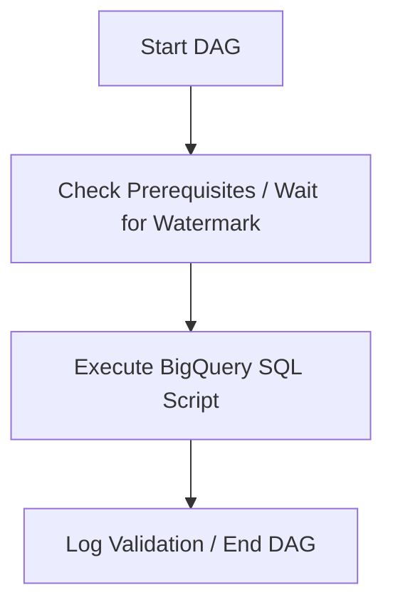

# MIGRATION DESIGN DOCUMENT: DW.BERT_AUSD_BP_TA_MSISDN_HIS

## 1. Executive Summary
This document defines the migration design for transitioning the historical tracking of MSISDNs associated with basic product tariff agreements from a legacy Oracle and UC4 environment to Google Cloud. 

The original architecture coordinates an Automic UC4 workflow that executes KornShell wrapper scripts (`r_ausd_bp_ta_msisdn_his.ksh` and `k_ausd_bp_ta_msisdn_his.ksh`), initializes the IS environment via `.dw_init`, and executes an Oracle PL/SQL data processing script (`d_ausd_bp_ta_msisdn_his.sql`). 

Following the prescribed **High Confidence** migration pattern (**UC4+KSH+SQL_MEDIUM**), we are converting this job pipeline to:
- **Orchestration**: Cloud Composer (Apache Airflow DAG)
- **Transformation Pipeline**: BigQuery SQL (implemented as a Dataform step or direct BigQuery script execution).

---

## 2. Source-to-Target (S&T) Lineage & Target File Plan

### 2.1 Upstream & Downstream Lineage
* **Source Tables**:
  - `isbert_schema.dwtk_meldungen` (Read) - Used to derive the processing watermark (`v_datum`).
  - `pds$ta_callnumber` (Read) - Master call number source table containing MSISDN details.
* **Target Table**:
  - `sof$ta_msisdn_his` (Write) - Historical staging table populated with active production MSISDNs.
* **External Systems & Database Links**:
  - The legacy variable `v_carmen = "@pcrs1"` indicates a database link query. In the BigQuery target architecture, this must map to a replicated dataset in BigQuery (populated via BigQuery Omni, Datastream, or an ELT process).

### 2.2 Target File Plan
We will replace the five legacy source files with the following assets:

| Legacy Source File | Target Path | Target Language | Description |
| :--- | :--- | :--- | :--- |
| `DW.BERT_AUSD_BP_TA_MSISDN_HIS.xml` | `dags/dw_bert_ausd_bp_ta_msisdn_his.py` | Python (Airflow DAG) | Airflow Orchestration DAG substituting UC4. |
| `r_ausd_bp_ta_msisdn_his.ksh` | *(Merged into Airflow)* | Python | Parameter extraction, logging, and environment parsing. |
| `k_ausd_bp_ta_msisdn_his.ksh` | *(Merged into Airflow)* | Python | Script validation and execution wrapper logic. |
| `d_ausd_bp_ta_msisdn_his.sql` | `definitions/d_ausd_bp_ta_msisdn_his.sqlx` | Dataform / BQ SQL | Core transformation and insert logic. |
| `.dw_init` | `config/env_config.json` | JSON | Externalized variables (Environment config). |

---

## 3. Environment-Specific Values & Configurations
To guarantee a repeatable build, the following metadata and structural transformations are applied:
* **Target Google Cloud Project**: `gcp-prod-dwh-project` (configured via Airflow variables)
* **Dataset Names**:
  - `isbert_schema` maps to the BigQuery dataset `isbert_schema_prod` or local analytics datasets.
  - Target tables will be placed in the `sof_dataset` or `isbert_schema_prod`.
* **Execution Parameters**:
  - `stichtag` (Reporting Date): Passed dynamically via Airflow's execution date context (`{{ ds }}`) or custom macros.
  - `v_datum` (Watermark Date): Retrieved dynamically inside the BigQuery transaction script.

---

## 4. Merged Translation Logic (HQL_SQL_to_BQSQL Output)

Below is the verbatim conversion logic generated by the transformation engine for the core data pipeline.

### 4.1 Equivalent BigQuery SQL Query
```sql
-- BigQuery Script Equivalent

DECLARE v_carmen STRING DEFAULT '@pcrs1';
DECLARE v_datum STRING;

SET v_datum = (
  SELECT IFNULL(FORMAT_DATE('%Y%m%d', DATE(MAX(m.timecreated))), '19000101')
  FROM `isbert_schema.dwtk_meldungen` m
  WHERE m.job_kennung = 'BERT_DROP_TEMP_TABLE'
);

-- Step01: truncate target table
TRUNCATE TABLE `sof$ta_msisdn_his`;

-- Step02: insert valid MSISDN records
INSERT INTO `sof$ta_msisdn_his`
  (BPRI_COM_ID, MSISDN, CALLNUMBER_ROLE_ID, VALID_TO)
SELECT
  cn1.bpri_com_id,
  CONCAT(cn1.cc, cn1.ndc, cn1.sn) AS msisdn,
  cn1.callnumber_role_id,
  cn1.valid_to
FROM `pds$ta_callnumber` cn1
WHERE cn1.insert_at <= PARSE_DATE('%Y%m%d', v_datum)
  AND (cn1.modified_at IS NULL OR cn1.modified_at > PARSE_DATE('%Y%m%d', v_datum))
  AND cn1.valid_from <= PARSE_DATE('%Y%m%d', v_datum)
  AND cn1.is_production = 1;
```

### 4.2 Low-Level Pseudocode
```text
BEGIN SCRIPT

  DEFINE v_carmen AS STRING = '@pcrs1'
  DEFINE v_datum AS STRING

  v_datum :=
    SELECT IFNULL(FORMAT_DATE('%Y%m%d', DATE(MAX(timecreated))), '19000101')
    FROM isbert_schema.dwtk_meldungen
    WHERE job_kennung = 'BERT_DROP_TEMP_TABLE'

  TRUNCATE TABLE sof$ta_msisdn_his

  INSERT INTO sof$ta_msisdn_his (
      BPRI_COM_ID,
      MSISDN,
      CALLNUMBER_ROLE_ID,
      VALID_TO
  )
  SELECT
      bpri_com_id,
      CONCAT(cc, ndc, sn) AS msisdn,
      callnumber_role_id,
      valid_to
  FROM pds$ta_callnumber
  WHERE insert_at <= PARSE_DATE('%Y%m%d', v_datum)
    AND (modified_at IS NULL OR modified_at > PARSE_DATE('%Y%m%d', v_datum))
    AND valid_from <= PARSE_DATE('%Y%m%d', v_datum)
    AND is_production = 1

END SCRIPT
```

---

## 5. Architectural Orchestration Plan (Airflow DAG)
The legacy UC4 and Shell scripting wrappers (`r_ausd_bp_ta_msisdn_his.ksh` & `k_ausd_bp_ta_msisdn_his.ksh`) will be consolidated into a simple Apache Airflow DAG in Cloud Composer.

### 5.1 Airflow DAG Flow


### 5.2 Airflow DAG Design Details
- **Scheduling**: The DAG will run daily, replicating the automated schedule from Automic.
- **Task 1: BigQueryInsertJobOperator** - Runs the compiled BigQuery script to truncate and insert the new batch of tracked MSISDNs.
- **Failures and Alerts**: In case of failures, standard SMTP notifications are configured, matching the original `DWMSG_Fehlerbehandlung` alerting mechanism.

---

## 6. Risks, Manual Steps, and Mitigations
* **DB Link Migration**: The query references Oracle's database link via `pds$ta_callnumber@pcrs1`. It is assumed that data replication pipelines (e.g. Datastream or Fivetran) have already migrated `pds$ta_callnumber` into BigQuery before this script executes.
* **Parallel Query Hints**: The original hint `/*+ full(cn1) parallel(cn1,4) */` is completely ignored in BigQuery since the engine manages query parallelism automatically. Performance should be verified against the BigQuery Slot Allocation.
* **Character Conversions**: The concatenations `cn1.cc||cn1.ndc||cn1.sn` are replaced with `CONCAT`. Ensure that all components are safely cast to `STRING` or handled as strings inside BigQuery to avoid nullification in the pipeline.