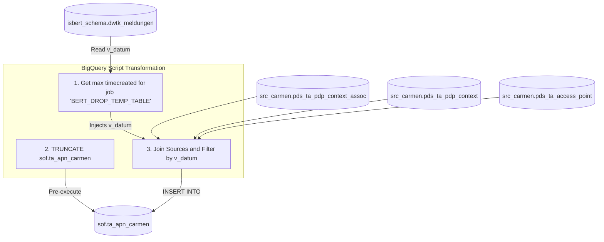

# Migration Design — ausd_bp_ta_apn_carmen

## 1. Purpose & Scope
The job `ausd_bp_ta_apn_carmen` is a component of the **BERT Stammdaten** system within the basic product preparation stage (`BERT_P_BASISPRODUKT`). Its core business purpose is to prepare and populate access point connection details from the instantiated basic products of the **CARMEN** source system and store them locally.

Specifically, this job performs the following processing steps:
1. Truncates the target database table `sof$ta_apn_carmen`.
2. Queries the reference execution date (`v_datum`) from the metadata table `isbert_schema.dwtk_meldungen` based on the job identifier `'BERT_DROP_TEMP_TABLE'`.
3. Joins three staging tables containing context associations, contexts, and access points from the remote CARMEN database link (`@pcrs1`).
4. Reconstructs the state of access point mappings as of the reference date using point-in-time temporal tracking columns (`insert_at`, `modified_at`, `valid_from`, and `valid_to`).
5. Populates the target table `sof$ta_apn_carmen` with the resulting contract-to-APN relationships.

This document outlines the target architecture, migration strategy, data mapping logic, and build plan to migrate this job from Oracle and UC4 to **Google Cloud BigQuery** and **Cloud Composer (Apache Airflow)**.

---

## 2. Source Inventory
The legacy job consists of the following 4 files:

| File Name | Technology | Complexity Tier | Automation Bucket | Legacy Role | Target Replaced By |
| :--- | :--- | :--- | :--- | :--- | :--- |
| `DW.BERT_AUSD_BP_TA_APN_CARMEN.xml` | UC4/Automic Job XML | Medium | Semi-Auto (65%) | Legacay UC4 scheduler job configuration executing Unix shell wrapper script. | Airflow DAG (`ausd_bp_ta_apn_carmen.py`) |
| `r_ausd_bp_ta_apn_carmen.ksh` | KornShell Wrapper | Medium | Semi-Auto (65%) | Primary shell wrapper which validates job execution limits, checks dates, and manages standard logging. | Airflow task orchestration and logging operators |
| `k_ausd_bp_ta_apn_carmen.ksh` | KornShell Control | Medium | Semi-Auto (65%) | Parses command parameters, formats execution variables, and invokes Oracle SQL via SQL*Plus wrapper. | BigQuery script variables |
| `d_ausd_bp_ta_apn_carmen.sql` | Oracle SQL | Medium | Semi-Auto (65%) | Executes TRUNCATE and DML query joining tables across the `@pcrs1` database link. | BigQuery SQL script (`d_ausd_bp_ta_apn_carmen.sql`) |

---

## 3. Target Architecture
The legacy Oracle/Unix setup will be migrated to the following modern Google Cloud Platform (GCP) target architecture:

### 3.1 Orchestration & Execution
- **Scheduler**: **Apache Airflow (Google Cloud Composer)** replaces UC4.
- **Processing Engine**: **Google Cloud BigQuery** replaces Oracle database processing.
- **Orchestration Flow**: The shell wrappers and SQL*Plus scripts are eliminated. Airflow uses the `BigQueryInsertJobOperator` to directly execute native BigQuery SQL script tasks.

### 3.2 Target BigQuery Table Layout

#### Target Output Table
- **Dataset**: `sof` (or core data warehouse layer)
- **Table Name**: `sof.ta_apn_carmen`
- **Fields**:
  - `CNTRCT_ID` (INT64) — Represents the contract ID.
  - `ACCESS_POINT_NAME` (STRING) — Represents the access point name.

#### Local Metadata Table
- **Dataset**: `isbert_schema`
- **Table Name**: `isbert_schema.dwtk_meldungen`
- **Fields**:
  - `job_kennung` (STRING)
  - `timecreated` (TIMESTAMP)

#### Source Replicated Tables (Replacing `@pcrs1`)
Since the database link `@pcrs1` cannot be accessed directly from BigQuery, the raw CARMEN source tables must be replicated from Oracle into a raw/landing BigQuery dataset (e.g. `src_carmen`) using an ingestion tool like **GCP Datastream** or **Cloud Data Fusion**:
- `src_carmen.pds_ta_pdp_context_assoc`
- `src_carmen.pds_ta_pdp_context`
- `src_carmen.pds_ta_access_point`

---

## 4. Data Flow & Lineage

### 4.1 Data Lineage Flow Diagram


### 4.2 Step Execution Order
1. **Initialize Job Execution**: Airflow initiates the DAG execution run.
2. **Retrieve Reference Date**: Query `isbert_schema.dwtk_meldungen` for the latest `timecreated` timestamp where `job_kennung = 'BERT_DROP_TEMP_TABLE'`. Extract and convert it to string format `'YYYYMMDD'`.
3. **Truncate Target**: Run DDL to truncate the target table `sof.ta_apn_carmen`.
4. **Data Join & Load**: Execute the native BigQuery script to read from the three source tables (`src_carmen.pds_ta_...`), apply point-in-time filtering logic based on the calculated reference date, and insert matching rows into the target table.
5. **Log Status**: Update execution status metadata.

---

## 5. Transformation Logic
The SQL logic from `d_ausd_bp_ta_apn_carmen.sql` translates directly to native BigQuery SQL. All Oracle-specific functions, such as `TO_DATE`, `TO_CHAR`, database link variables (`&v_carmen`), and script substitution parameters (`&v_datum`), have been replaced with standard ANSI/BigQuery constructs.

### 5.1 Oracle vs BigQuery SQL Conversion Details
- **Oracle DB Link**: `@pcrs1` is replaced by the prefixing dataset path `your-gcp-project.src_carmen.`.
- **Truncate Execution**: `isbert_schema.DWPA_UTIL_SKRIPT.runstatement(0, 'TRUNCATE...')` is replaced with standard BigQuery `TRUNCATE TABLE`.
- **Date Comparison Logic**: Dates are parsed and cast using BigQuery's native `PARSE_DATE` and `DATE` types.
- **Substitution Variable**: `v_datum` is declared as a scripting variable within the BigQuery execution scope.

### 5.2 BigQuery SQL Script (`d_ausd_bp_ta_apn_carmen.sql`)
```sql
-- ===================================================================
-- Translated BigQuery SQL script for: d_ausd_bp_ta_apn_carmen
-- Target Platform: BigQuery (Google Cloud)
-- ===================================================================

-- Step 1: Declare and calculate the reference date (v_datum)
DECLARE v_datum STRING;

SET v_datum = (
  SELECT COALESCE(FORMAT_DATE('%Y%m%d', MAX(DATE(timecreated))), '19000101')
  FROM `your-gcp-project.isbert_schema.dwtk_meldungen`
  WHERE job_kennung = 'BERT_DROP_TEMP_TABLE'
);

-- Step 2: Truncate the target table
TRUNCATE TABLE `your-gcp-project.sof.ta_apn_carmen`;

-- Step 3: Populate the target table with temporal-filtered associations
INSERT INTO `your-gcp-project.sof.ta_apn_carmen` (
  CNTRCT_ID,
  ACCESS_POINT_NAME
)
SELECT 
  pca.cntrct_id,
  ap.access_point_name
FROM `your-gcp-project.src_carmen.pds_ta_pdp_context_assoc` pca
INNER JOIN `your-gcp-project.src_carmen.pds_ta_pdp_context` pc
  ON pca.pdp_context_id = pc.pdp_context_id
INNER JOIN `your-gcp-project.src_carmen.pds_ta_access_point` ap
  ON pc.access_point_id = ap.access_point_id
WHERE pca.insert_at <= PARSE_DATE('%Y%m%d', v_datum)
  AND (pca.modified_at IS NULL OR pca.modified_at > PARSE_DATE('%Y%m%d', v_datum))
  AND pca.valid_from <= PARSE_DATE('%Y%m%d', v_datum)
  AND (pca.valid_to IS NULL OR pca.valid_to > PARSE_DATE('%Y%m%d', v_datum))
  AND pc.insert_at <= PARSE_DATE('%Y%m%d', v_datum)
  AND (pc.modified_at IS NULL OR pc.modified_at > PARSE_DATE('%Y%m%d', v_datum))
  AND pc.is_production = 1
  AND ap.insert_at <= PARSE_DATE('%Y%m%d', v_datum)
  AND (ap.modified_at IS NULL OR ap.modified_at > PARSE_DATE('%Y%m%d', v_datum))
  AND pca.cntrct_id IS NOT NULL;
```

---

## 6. External Dependencies
1. **Replication of CARMEN Tables**: The source tables (`pds_ta_pdp_context_assoc`, `pds_ta_pdp_context`, and `pds_ta_access_point`) must be fully synchronized from the CARMEN Oracle database to the BigQuery dataset `src_carmen` prior to executing this job.
2. **Upstream Trigger**: The table `isbert_schema.dwtk_meldungen` must be updated with the latest run of `BERT_DROP_TEMP_TABLE` to ensure the correct `v_datum` date is applied.
3. **Environment Setup**: GCP-specific project-id references should be parameterized in the SQL and Airflow configuration.

---

## 7. Unresolved / Risks
- **Data Latency Gaps**: If the replication of CARMEN source tables is delayed or fails, this job will read outdated/stale records from the staging dataset. To prevent this, an Airflow sensor check or a task-dependency trigger should verify that the replication is complete before executing the SQL transformation.
- **Handling of Oracle Date Limits**: Oracle sometimes stores default empty dates as `9999-12-31`. BigQuery supports this value under the `DATE` data type, but this must be verified against source schema limits.
- **Empty reference date fallback**: If no row matching `BERT_DROP_TEMP_TABLE` is present in `dwtk_meldungen`, the query defaults `v_datum` to `'19000101'`. This acts as a safety default but will result in 0 records loaded, which should be configured to trigger an alert if it occurs in production.

---

## 8. Build Plan

This plan describes the sequential build artifacts that are required to deploy the migrated job.

### Step 8.1: Target Table DDL Generation
Create the target table in BigQuery with correct types.

```sql
CREATE TABLE IF NOT EXISTS `your-gcp-project.sof.ta_apn_carmen` (
  CNTRCT_ID INT64 OPTIONS(description="Contract identifier"),
  ACCESS_POINT_NAME STRING OPTIONS(description="Name of the access point")
);
```

### Step 8.2: Airflow DAG Deployment
Save the following orchestrating DAG script as `ausd_bp_ta_apn_carmen.py` and upload it to the Cloud Composer DAGs folder in Google Cloud Storage.

```python
"""
Airflow DAG replacing UC4 / KornShell orchestration for job: ausd_bp_ta_apn_carmen
"""
from datetime import datetime, timedelta
from airflow import DAG
from airflow.providers.google.cloud.operators.bigquery import BigQueryInsertJobOperator

default_args = {
    'owner': 'bert-data-engineering',
    'depends_on_past': False,
    'email_on_failure': True,
    'email_on_retry': False,
    'retries': 1,
    'retry_delay': timedelta(minutes=5),
}

# Define the DAG
with DAG(
    'dag_ausd_bp_ta_apn_carmen',
    default_args=default_args,
    description='BERT basic product preparation: extract APN connection details from CARMEN',
    schedule_interval='0 4 * * *', # Daily execution (adjust as needed based on upstreams)
    start_date=datetime(2023, 1, 1),
    catchup=False,
    tags=['bert', 'stammdaten', 'carmen', 'dwh'],
) as dag:

    # Execute the BigQuery transformation script
    run_ta_apn_carmen_transformation = BigQueryInsertJobOperator(
        task_id='run_ta_apn_carmen_transformation',
        configuration={
            "query": {
                "query": """
                DECLARE v_datum STRING;

                SET v_datum = (
                  SELECT COALESCE(FORMAT_DATE('%Y%m%d', MAX(DATE(timecreated))), '19000101')
                  FROM `your-gcp-project.isbert_schema.dwtk_meldungen`
                  WHERE job_kennung = 'BERT_DROP_TEMP_TABLE'
                );

                TRUNCATE TABLE `your-gcp-project.sof.ta_apn_carmen`;

                INSERT INTO `your-gcp-project.sof.ta_apn_carmen` (
                  CNTRCT_ID,
                  ACCESS_POINT_NAME
                )
                SELECT 
                  pca.cntrct_id,
                  ap.access_point_name
                FROM `your-gcp-project.src_carmen.pds_ta_pdp_context_assoc` pca
                INNER JOIN `your-gcp-project.src_carmen.pds_ta_pdp_context` pc
                  ON pca.pdp_context_id = pc.pdp_context_id
                INNER JOIN `your-gcp-project.src_carmen.pds_ta_access_point` ap
                  ON pc.access_point_id = ap.access_point_id
                WHERE pca.insert_at <= PARSE_DATE('%Y%m%d', v_datum)
                  AND (pca.modified_at IS NULL OR pca.modified_at > PARSE_DATE('%Y%m%d', v_datum))
                  AND pca.valid_from <= PARSE_DATE('%Y%m%d', v_datum)
                  AND (pca.valid_to IS NULL OR pca.valid_to > PARSE_DATE('%Y%m%d', v_datum))
                  AND pc.insert_at <= PARSE_DATE('%Y%m%d', v_datum)
                  AND (pc.modified_at IS NULL OR pc.modified_at > PARSE_DATE('%Y%m%d', v_datum))
                  AND pc.is_production = 1
                  AND ap.insert_at <= PARSE_DATE('%Y%m%d', v_datum)
                  AND (ap.modified_at IS NULL OR ap.modified_at > PARSE_DATE('%Y%m%d', v_datum))
                  AND pca.cntrct_id IS NOT NULL;
                """,
                "useLegacySql": False,
            }
        },
    )

    run_ta_apn_carmen_transformation