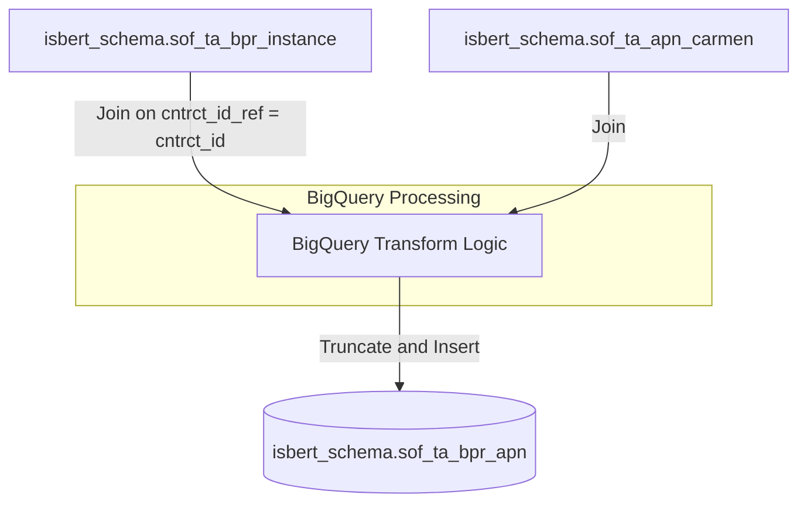

# Migration Design — ausd_bp_ta_bpr_apn

This document details the migration design for transferring the legacy UC4 job **DW.BERT_AUSD_BP_TA_BPR_APN** and its associated KornShell scripts and Oracle SQL scripts to Google Cloud Platform (GCP) using Google Cloud Composer (Apache Airflow) and BigQuery.

---

## 1. Purpose & Scope

### 1.1 Legacy Business Purpose
The legacy job `DW.BERT_AUSD_BP_TA_BPR_APN` processes refined, instantiated basic products (such as VPNs, Telemetry, Blackberry solutions) by pairing them with their respective Access Point Names (APN) using contract references. This structured data is consolidated and loaded into the credit scoring target table (`sof$ta_bpr_apn`), which is subsequently read by downstream rating, risk, and credit scoring systems (BERT/FOS - Forderungsscoring).

### 1.2 Migration Scope
The migration encompasses:
- Retiring the UC4 schedule object and replacing it with a **Google Cloud Composer (Airflow)** DAG.
- Consolidating and retiring the parameter-parsing/wrapper shell scripts (`r_ausd_bp_ta_bpr_apn.ksh` and `k_ausd_bp_ta_bpr_apn.ksh`) by moving the orchestrational logic, dates, and parameter validation directly into Airflow.
- Modernizing and converting the Oracle SQL*Plus script (`d_ausd_bp_ta_bpr_apn.sql`) into a standard **BigQuery SQL** script executed via the `BigQueryExecuteQueryOperator`.

---

## 2. Source Inventory

The following source files define this job:

| File Path | Tech | Complexity Tier | Automation Rate | Migration Bucket |
| :--- | :--- | :--- | :--- | :--- |
| `DW.BERT_AUSD_BP_TA_BPR_APN.xml` | UC4/Automic XML | Medium | 0.65 | **Semi-Automatic** (Re-orchestrate into Airflow DAG) |
| `r_ausd_bp_ta_bpr_apn.ksh` | KornShell (Wrapper) | Medium | 1.00 | **Retire** (Logic absorbed by Airflow metadata & variables) |
| `k_ausd_bp_ta_bpr_apn.ksh` | KornShell (Control) | Medium | 0.65 | **Retire** (Logic absorbed by BigQuery SQL pipeline) |
| `d_ausd_bp_ta_bpr_apn.sql` | Oracle SQL*Plus | Medium | 0.65 | **Semi-Automatic** (Refactor to standard BQ SQL) |

---

## 3. Target Architecture

The target architecture replaces the legacy on-premise execution framework with managed GCP cloud-native components.

### 3.1 Architecture Overview
- **Orchestration**: Google Cloud Composer (Apache Airflow 2.x).
- **Compute & Storage Engine**: Google BigQuery.
- **Environment Management**: Airflow variables and GCP connections are used to manage project names, database datasets, and environments (Dev/Test/Prod).

### 3.2 Component Mapping

| Legacy Component | Target Component | Description |
| :--- | :--- | :--- |
| **UC4 Scheduler** | Google Cloud Composer (Airflow) | Triggers the pipeline, monitors tasks, handles retries, and records execution metadata. |
| **KornShell Wrappers** | Airflow Python / Operator | Wrapper logic, environment initialization (`.dw_init`), and execution logging are replaced by standard Airflow pipeline parameters. |
| **Oracle Database** | BigQuery Dataset | Source and target tables are represented inside a BigQuery dataset (e.g. `isbert_schema`). |
| **`sof$ta_bpr_apn` (Table)** | `isbert_schema.sof_ta_bpr_apn` | Target BigQuery table. Special characters (`$`) are modernized to underscores (`_`) to meet standard BigQuery conventions. |

---

## 4. Data Flow & Lineage

The data pipeline processes records and loads the refined APN mappings.

### 4.1 Dependency Hierarchy
1. Upstream jobs must populate source tables:
   - `isbert_schema.sof_ta_bpr_instance` (Active base product instances)
   - `isbert_schema.sof_ta_apn_carmen` (Contract-to-APN mappings)
2. The Airflow DAG executes the BigQuery script to truncate the target table `isbert_schema.sof_ta_bpr_apn` and load fresh refined records.

### 4.2 Data Lineage Diagram


---

## 5. Transformation Logic

The SQL transformation contains logic to join contract instances with APN mappings. The conversion from Oracle SQL*Plus to BigQuery SQL incorporates several optimization steps.

### 5.1 Legacy Code vs. BigQuery Refactoring
1. **Dead Code Elimination**: The legacy script queried the `isbert_schema.dwtk_meldungen` table to set a variable `v_datum` from the job `BERT_DROP_TEMP_TABLE`. However, a historical refactoring (version `10.2.1`) removed the variable from all target table names. This select query is dead code and is entirely excluded from the target BigQuery query to avoid unnecessary execution overhead and costs.
2. **Oracle Hint Removal**: The optimizer hints `/*+ full(bp) parallel(bp,4) full(ap) parallel(ap,4) */` are legacy performance tuners for Oracle. In BigQuery, these are non-functional and are stripped out since BigQuery automatically executes and parallelizes queries dynamically.
3. **Database Object Rename**: The table names are modernized to conform to Google Cloud best practices. Special characters such as `$` (e.g., `sof$ta_bpr_apn`) are replaced with standard underscores (`_`).

### 5.2 BigQuery DML Query
The optimized, BigQuery-compatible DML SQL query runs as follows:

```sql
-- Step 1: Empty target table to prepare for clean daily reload
TRUNCATE TABLE `isbert_schema.sof_ta_bpr_apn`;

-- Step 2: Insert refined APN references from active instances
INSERT INTO `isbert_schema.sof_ta_bpr_apn` (
  cntrct_id,
  bpr_id,
  cntrct_id_ref,
  access_point_name
)
SELECT DISTINCT
  bp.cntrct_id,
  bp.bpr_id,
  bp.cntrct_id_ref,
  ap.access_point_name
FROM `isbert_schema.sof_ta_bpr_instance` bp
INNER JOIN `isbert_schema.sof_ta_apn_carmen` ap
   ON bp.cntrct_id_ref = ap.cntrct_id
WHERE bp.bpr_id IN (
  2828, -- vpn
  2829, -- iv_vpn
  2830, -- wap-intranet
  2831, -- telemetrie
  2925, -- mobile ip vpn (50% discount)
  2926, -- mobile ip vpn (100% discount)
  2998, -- blackberry solution
  2999, -- blackberry solution (10% discount)
  3000  -- blackberry solution (20% discount)
);
```

---

## 6. External Dependencies

1. **Upstream Tables**: The job is strictly dependent on the completion of upstream ingestion pipelines feeding `sof_ta_bpr_instance` and `sof_ta_apn_carmen`.
2. **KornShell Commented-out Logic**: The shell control script (`k_ausd_bp_ta_bpr_apn.ksh`) had commented-out commands running `sed`, `sort`, and `join` on temporary text files (`cibasis_data24.dat`, `cibasis_data96.dat`, and `cibasis_fax.dat`). This logic has been fully retired and is not included in the cloud migration.
3. **Audit Trails**: The legacy `FOSJobErzeugeEintrag` log-writing process is retired. In Airflow, execution monitoring, runtime errors, and the number of affected rows (using BigQuery execution job statistics) are automatically preserved in the Google Cloud Logging console.

---

## 7. Unresolved Issues / Risks

- **Data Volume Dry-Run**: Since hints are removed, a dry-run execution on a pre-production dataset is required to evaluate BigQuery slot consumption and runtime performance.
- **Stichtag Date Filter**: The legacy shell script took a `Stichtag` parameter, which was passed to `starteSQLSkript` but never referenced in the active SQL query. This parameter is verified as redundant and omitted from the SQL logic. Should upstream sources begin requiring date-partition filtering, the BigQuery table should be configured as a partitioned table, and filters should be introduced.
- **Audit Requirement**: If downstream business metrics require a physical table log similar to `dwtk_meldungen`, an audit step must be added to the Airflow DAG to append status details upon successful pipeline runs.

---

## 8. Build Plan

To deploy this job, execute the following steps in sequence:

### Step 1: Create BigQuery Target Table (DDL)
Run the following DDL script in BigQuery to initialize the target table:

```sql
CREATE OR REPLACE TABLE `isbert_schema.sof_ta_bpr_apn` (
  cntrct_id INT64 OPTIONS(description="ID of the contract"),
  bpr_id INT64 OPTIONS(description="ID of the basis product"),
  cntrct_id_ref INT64 OPTIONS(description="Referenced contract ID"),
  access_point_name STRING OPTIONS(description="Access Point Name (APN)")
)
OPTIONS(
  description="Consolidated table containing instantiated base products mapped to their APN"
);
```

### Step 2: Deploy Airflow Orchestration DAG
Create and upload the following Python file (`ausd_bp_ta_bpr_apn.py`) into the Composer DAGs folder in Google Cloud Storage:

```python
from datetime import datetime, timedelta
from airflow import DAG
from airflow.providers.google.cloud.operators.bigquery import BigQueryExecuteQueryOperator
from airflow.operators.empty import EmptyOperator

# Default arguments for the DAG pipeline execution
default_args = {
    "owner": "data_migration_team",
    "depends_on_past": False,
    "start_date": datetime(2024, 1, 1),
    "email_on_failure": False,
    "email_on_retry": False,
    "retries": 1,
    "retry_delay": timedelta(minutes=5),
}

# Define Orchestration Pipeline
with DAG(
    dag_id="ausd_bp_ta_bpr_apn_dag",
    default_args=default_args,
    description="Processes instantiated basic products and maps Access Point Names",
    schedule_interval="0 4 * * *",  # Set to run daily at 04:00 AM
    catchup=False,
    tags=["bert", "dwh", "basisprodukt", "bigquery"],
) as dag:

    start_pipeline = EmptyOperator(task_id="start_pipeline")

    # Single-operator task executing the clean-up and reload transformation query
    transform_basisprodukte_apn = BigQueryExecuteQueryOperator(
        task_id="transform_basisprodukte_apn",
        sql="""
            -- Truncate target table to guarantee daily clean load
            TRUNCATE TABLE `{{ var.value.gcp_project }}.isbert_schema.sof_ta_bpr_apn`;

            -- Insert filtered, unique base product instances mapped to APN
            INSERT INTO `{{ var.value.gcp_project }}.isbert_schema.sof_ta_bpr_apn` (
              cntrct_id,
              bpr_id,
              cntrct_id_ref,
              access_point_name
            )
            SELECT DISTINCT
              bp.cntrct_id,
              bp.bpr_id,
              bp.cntrct_id_ref,
              ap.access_point_name
            FROM `{{ var.value.gcp_project }}.isbert_schema.sof_ta_bpr_instance` bp
            INNER JOIN `{{ var.value.gcp_project }}.isbert_schema.sof_ta_apn_carmen` ap
               ON bp.cntrct_id_ref = ap.cntrct_id
            WHERE bp.bpr_id IN (
              2828, -- vpn
              2829, -- iv_vpn
              2830, -- wap-intranet
              2831, -- telemetrie
              2925, -- mobile ip vpn (50% discount)
              2926, -- mobile ip vpn (100% discount)
              2998, -- blackberry solution
              2999, -- blackberry solution (10% discount)
              3000  -- blackberry solution (20% discount)
            );
        """,
        use_legacy_sql=False,
        gcp_conn_id="google_cloud_default",
    )

    end_pipeline = EmptyOperator(task_id="end_pipeline")

    # Define DAG tasks execution order
    start_pipeline >> transform_basisprodukte_apn >> end_pipeline
```