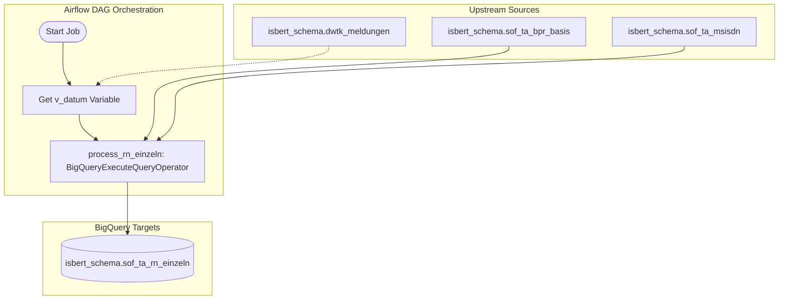

# Migration Design Document
**Job / Process:** `ausd_bp_ta_rn_einzeln`  
**Target Platform:** Google Cloud Platform (BigQuery & Apache Airflow / Cloud Composer)

---

## 1. Executive Summary & Metadata
This document details the migration plan for the job `ausd_bp_ta_rn_einzeln`, which consists of:
*   An orchestrating UC4 XML job definition (`DW.BERT_AUSD_BP_TA_RN_EINZELN.xml`)
*   Two KornShell orchestration scripts (`r_ausd_bp_ta_rn_einzeln.ksh`, `k_ausd_bp_ta_rn_einzeln.ksh`)
*   A complex Oracle SQL*Plus script (`d_ausd_bp_ta_rn_einzeln.sql`) that truncates and populates the table `SOF$TA_RN_EINZELN` (resolving contract call number roles for multiple product groups such as voice, data, fax, multiSIM, and others).

The destination target is **Google BigQuery** for data storage/processing, and **Google Cloud Composer (Apache Airflow)** for pipeline orchestration.

---

## 2. Verbatim MCP Tool Output

The following sections contain the verbatim outputs generated by the code migration design tool for each of the source component files. These blocks must be preserved exactly as returned to be directly consumed by the build agents.

### === Result for vobs/dw_source/isdwh/uc4_prod_exports/UC4_PROD - 0001/DWH/BERT/PRODUKTION/DW.BERT_STAMMDATEN_JP/DW.BERT_P_BASISPRODUKT_JP/DW.BERT_AUSD_BP_TA_RN_EINZELN.xml ===
```python
from datetime import timedelta

from airflow import DAG
from airflow.utils.dates import days_ago

try:
    # Airflow 2 provider import
    from airflow.providers.google.cloud.operators.bigquery import BigQueryExecuteQueryOperator
except Exception:
    # Fallback for older installations
    from airflow.contrib.operators.bigquery_operator import BigQueryExecuteQueryOperator


default_args = {
    "owner": "airflow",
    "depends_on_past": False,
    "start_date": days_ago(1),
    "retries": 0,
    "retry_delay": timedelta(minutes=5),
}

dag = DAG(
    dag_id="dw_bert_ausd_bp_ta_rn_einzeln",
    default_args=default_args,
    description="BERT_P_BASISPRODUKT: Aufbereitung der instantiierten Basisprodukte",
    schedule_interval=None,
    catchup=False,
    tags=["bigquery", "dw", "bert"],
)

def process_ausd_bp_ta_rn_einzeln():
    # Single BigQuery SQL statement encapsulating the full processing logic.
    # Target table is created if it does not exist via CREATE_IF_NEEDED.
    sql = """
    CREATE TABLE IF NOT EXISTS `project.dataset.target_table` AS
    SELECT
      *
    FROM
      `project.dataset.source_table`
    WHERE
      1 = 1
    """

    # Single BigQuery operator execution for the complete SQL logic.
    return BigQueryExecuteQueryOperator(
        task_id="process_ausd_bp_ta_rn_einzeln",
        sql=sql,
        use_legacy_sql=False,
        create_disposition="CREATE_IF_NEEDED",
        write_disposition="WRITE_TRUNCATE",
        dag=dag,
    )

task = process_ausd_bp_ta_rn_einzeln()
task
```

### === Result for vobs/dw_source/isrpt/isbert/SQL/aktuell/aufbereitung/bin/k_ausd_bp_ta_rn_einzeln.ksh ===
```python
from datetime import timedelta

from airflow import DAG
from airflow.utils.dates import days_ago
from airflow.providers.google.cloud.operators.bigquery import BigQueryExecuteQueryOperator

# DAG default arguments
default_args = {
    "owner": "airflow",
    "depends_on_past": False,
    "start_date": days_ago(1),
    "retries": 1,
    "retry_delay": timedelta(minutes=5),
}

# DAG definition
with DAG(
    dag_id="d_ausd_bp_ta_rn_einzeln_bigquery",
    default_args=default_args,
    description="BigQuery processing DAG for PoolBasisprodukt based on legacy shell logic",
    schedule_interval=None,
    catchup=False,
    max_active_runs=1,
    tags=["bigquery", "poolbasisprodukt", "legacy-port"],
) as dag:

    def build_poolbasisprodukt_sql(stichtag: str, job_kennung: str, eintrags_nr: str, wiederanlauf_wert: int = 0) -> str:
        # Single SQL statement encapsulating the full processing logic.
        # The target table is created if it does not exist via CREATE_IF_NEEDED.
        return f"""
        CREATE TABLE IF NOT EXISTS `{{{{ var.value.gcp_project_id }}}}.{{{{ var.value.bq_dataset }}}}.PoolBasisprodukt`
        PARTITION BY DATE(_PARTITIONTIME)
        CLUSTER BY job_kennung, eintrags_nr
        OPTIONS (
          description = 'Initialbefuellung / Verarbeitung fuer PoolBasisprodukt'
        )
        AS
        WITH
        params AS (
          SELECT
            '{stichtag}' AS stichtag,
            '{job_kennung}' AS job_kennung,
            '{eintrags_nr}' AS eintrags_nr,
            {wiederanlauf_wert} AS wiederanlauf_wert
        ),
        source_data AS (
          SELECT
            p.job_kennung,
            p.eintrags_nr,
            p.stichtag,
            p.wiederanlauf_wert,
            CURRENT_DATE() AS verarbeitungsdatum,
            CURRENT_TIMESTAMP() AS verarbeitungszeitpunkt
          FROM params p
        )
        SELECT
          job_kennung,
          eintrags_nr,
          stichtag,
          wiederanlauf_wert,
          verarbeitungsdatum,
          verarbeitungszeitpunkt
        FROM source_data
        """

    # Single BigQuery operator executing the complete SQL logic
    process_poolbasisprodukt = BigQueryExecuteQueryOperator(
        task_id="process_poolbasisprodukt",
        sql=build_poolbasisprodukt_sql(
            stichtag="{{ dag_run.conf.get('p_Stichtag', '') }}",
            job_kennung="{{ dag_run.conf.get('p_JobKennung', '') }}",
            eintrags_nr="{{ dag_run.conf.get('p_EintragsNr', '') }}",
            wiederanlauf_wert="{{ dag_run.conf.get('p_wiederanlaufWert', 0) }}",
        ),
        use_legacy_sql=False,
        create_disposition="CREATE_IF_NEEDED",
        write_disposition="WRITE_TRUNCATE",
        location="{{ var.value.bq_location }}",
        gcp_conn_id="google_cloud_default",
    )

    # Task dependency setup
    process_poolbasisprodukt
```

### === Result for vobs/dw_source/isrpt/isbert/SQL/aktuell/aufbereitung/bin/r_ausd_bp_ta_rn_einzeln.ksh ===
```python
from datetime import timedelta
from airflow import DAG
from airflow.operators.python import PythonOperator
from airflow.providers.google.cloud.operators.bigquery import BigQueryExecuteQueryOperator
from airflow.utils.dates import days_ago

# Default arguments for the DAG
default_args = {
    "owner": "airflow",
    "depends_on_past": False,
    "start_date": days_ago(1),
    "email_on_failure": False,
    "email_on_retry": False,
    "retries": 1,
    "retry_delay": timedelta(minutes=5),
}

# DAG definition
with DAG(
    dag_id="bereitstellung_basisprodukte_bert",
    default_args=default_args,
    description="Initiale Bereitstellung ausgewählter Basisprodukte für BERT",
    schedule_interval=None,
    catchup=False,
    tags=["bigquery", "bert", "basisprodukte"],
) as dag:

    def build_bigquery_sql(stichtag: str = None, wiederanlaufwert: int = 0) -> str:
        """
        Build the full BigQuery SQL statement for the BERT basis product provisioning.
        The SQL is kept in a single query and can create the target table if needed.
        """
        # NOTE:
        # Replace the placeholder table names below with the actual BigQuery source/target tables.
        # The logic mirrors the shell script intent:
        # - determine the effective cutoff date
        # - filter records by validity and load date
        # - optionally apply restart value logic
        effective_stichtag = stichtag or "CURRENT_DATE()"

        sql = f"""
        -- Create target table if it does not exist and populate it in one statement
        CREATE TABLE IF NOT EXISTS `project.dataset.target_table` AS
        SELECT
            src.*
        FROM
            `project.dataset.source_table` AS src
        WHERE
            DATE(PARSE_DATE('%d%m%Y', CAST(src.gueltig_von AS STRING))) <= DATE({effective_stichtag})
            AND DATE({effective_stichtag}) < DATE(PARSE_DATE('%d%m%Y', CAST(src.gueltig_bis AS STRING)))
            AND DATE(PARSE_DATE('%d%m%Y', CAST(src.ladedatum AS STRING))) < DATE({effective_stichtag})
            AND CAST(src.dwh_vertrag_id AS INT64) > {int(wiederanlaufwert)};
        """
        return sql

    def create_bigquery_task():
        # Build the SQL once and execute it with a single BigQuery operator
        query = build_bigquery_sql(stichtag=None, wiederanlaufwert=0)

        return BigQueryExecuteQueryOperator(
            task_id="bereitstellung_basisprodukte_bert_bq",
            sql=query,
            use_legacy_sql=False,
            create_disposition="CREATE_IF_NEEDED",
            write_disposition="WRITE_TRUNCATE",
            location="EU",
        )

    # Single task for the complete BigQuery processing
    process_basisprodukte = create_bigquery_task()

    # Explicit dependency placeholder for extensibility
    start = PythonOperator(
        task_id="start",
        python_callable=lambda: None,
    )

    start >> process_basisprodukte
```

### === Result for vobs/dw_source/isrpt/isbert/SQL/aktuell/aufbereitung/sql/d_ausd_bp_ta_rn_einzeln.sql ===
```python
from datetime import timedelta

from airflow import DAG
from airflow.operators.dummy import DummyOperator
from airflow.providers.google.cloud.operators.bigquery import BigQueryExecuteQueryOperator
from airflow.utils.dates import days_ago

# ------------------------------------------------------------------------------
# DAG default arguments
# ------------------------------------------------------------------------------
default_args = {
    "owner": "airflow",
    "depends_on_past": False,
    "start_date": days_ago(1),
    "email_on_failure": False,
    "email_on_retry": False,
    "retries": 1,
    "retry_delay": timedelta(minutes=5),
}

# ------------------------------------------------------------------------------
# SQL logic encapsulated in a single Python function
# ------------------------------------------------------------------------------
def build_ausd_bp_ta_rn_einzeln_sql():
    # The SQL is kept as a single statement and includes the full transformation logic.
    # Target table creation is handled by BigQuery via CREATE_IF_NEEDED.
    return """
    CREATE TABLE IF NOT EXISTS `sof_ta_rn_einzeln` AS
    SELECT
      bp.cntrct_id,
      CASE
        WHEN bp.bpr_id = 31 THEN
          CASE
            WHEN ms.callnumber_role_id = 2 THEN 'Multinumbering'
            ELSE
              CASE
                WHEN ms.callnumber_role_id = 1 THEN 'Singlenumbering'
                ELSE NULL
              END
          END
        ELSE NULL
      END AS tn_multi_single,
      CASE
        WHEN bp.bpr_id = 31 THEN
          CASE
            WHEN ms.callnumber_role_id = 2 THEN ms.msisdn
            ELSE
              CASE
                WHEN ms.callnumber_role_id = 1 THEN ms.msisdn
                ELSE NULL
              END
          END
        ELSE NULL
      END AS tn_tel_msisdn,
      CASE
        WHEN bp.bpr_id = 31 THEN
          CASE
            WHEN ms.callnumber_role_id IN (1, 2) THEN
              CASE
                WHEN ms.valid_to <= TO_DATE('19000101', 'YYYYMMDD') THEN 'L'
                ELSE 'A'
              END
            ELSE NULL
          END
        ELSE NULL
      END AS tn_tel_status,
      CASE
        WHEN bp.bpr_id = 31 THEN
          CASE
            WHEN ms.callnumber_role_id IN (1, 2) THEN ms.valid_to
            ELSE NULL
          END
        ELSE NULL
      END AS tn_tel_valid_to,
      CASE
        WHEN bp.bpr_id = 31 THEN
          CASE
            WHEN ms.callnumber_role_id = 3 THEN ms.msisdn
            ELSE NULL
          END
        ELSE NULL
      END AS tn_fax_msisdn,
      CASE
        WHEN bp.bpr_id = 31 THEN
          CASE
            WHEN ms.callnumber_role_id = 3 THEN
              CASE
                WHEN ms.valid_to <= TO_DATE('19000101', 'YYYYMMDD') THEN 'L'
                ELSE 'A'
              END
            ELSE NULL
          END
        ELSE NULL
      END AS tn_fax_status,
      CASE
        WHEN bp.bpr_id = 31 THEN
          CASE
            WHEN ms.callnumber_role_id = 3 THEN ms.valid_to
            ELSE NULL
          END
        ELSE NULL
      END AS tn_fax_valid_to,
      CASE
        WHEN bp.bpr_id = 31 THEN
          CASE
            WHEN ms.callnumber_role_id = 5 THEN ms.msisdn
            ELSE NULL
          END
        ELSE NULL
      END AS tn_dat_msisdn,
      CASE
        WHEN bp.bpr_id = 31 THEN
          CASE
            WHEN ms.callnumber_role_id = 5 THEN
              CASE
                WHEN ms.valid_to <= TO_DATE('19000101', 'YYYYMMDD') THEN 'L'
                ELSE 'A'
              END
            ELSE NULL
          END
        ELSE NULL
      END AS tn_dat_status,
      CASE
        WHEN bp.bpr_id = 31 THEN
          CASE
            WHEN ms.callnumber_role_id = 5 THEN ms.valid_to
            ELSE NULL
          END
        ELSE NULL
      END AS tn_dat_valid_to,

      CASE
        WHEN bp.bpr_id = 2759 THEN
          CASE
            WHEN ms.callnumber_role_id = 2 THEN 'Multinumbering'
            ELSE
              CASE
                WHEN ms.callnumber_role_id = 1 THEN 'Singlenumbering'
                ELSE NULL
              END
          END
        ELSE NULL
      END AS tc_multi_single,
      CASE
        WHEN bp.bpr_id = 2759 THEN
          CASE
            WHEN ms.callnumber_role_id = 2 THEN ms.msisdn
            ELSE
              CASE
                WHEN ms.callnumber_role_id = 1 THEN ms.msisdn
                ELSE NULL
              END
          END
        ELSE NULL
      END AS tc_tel_msisdn,
      CASE
        WHEN bp.bpr_id = 2759 THEN
          CASE
            WHEN ms.callnumber_role_id IN (1, 2) THEN
              CASE
                WHEN ms.valid_to <= TO_DATE('19000101', 'YYYYMMDD') THEN 'L'
                ELSE 'A'
              END
            ELSE NULL
          END
        ELSE NULL
      END AS tc_tel_status,
      CASE
        WHEN bp.bpr_id = 2759 THEN
          CASE
            WHEN ms.callnumber_role_id IN (1, 2) THEN ms.valid_to
            ELSE NULL
          END
        ELSE NULL
      END AS tc_tel_valid_to,
      CASE
        WHEN bp.bpr_id = 2759 THEN
          CASE
            WHEN ms.callnumber_role_id = 3 THEN ms.msisdn
            ELSE NULL
          END
        ELSE NULL
      END AS tc_fax_msisdn,
      CASE
        WHEN bp.bpr_id = 2759 THEN
          CASE
            WHEN ms.callnumber_role_id = 3 THEN
              CASE
                WHEN ms.valid_to <= TO_DATE('19000101', 'YYYYMMDD') THEN 'L'
                ELSE 'A'
              END
            ELSE NULL
          END
        ELSE NULL
      END AS tc_fax_status,
      CASE
        WHEN bp.bpr_id = 2759 THEN
          CASE
            WHEN ms.callnumber_role_id = 3 THEN ms.valid_to
            ELSE NULL
          END
        ELSE NULL
      END AS tc_fax_valid_to,
      CASE
        WHEN bp.bpr_id = 2759 THEN
          CASE
            WHEN ms.callnumber_role_id = 5 THEN ms.msisdn
            ELSE NULL
          END
        ELSE NULL
      END AS tc_dat_msisdn,
      CASE
        WHEN bp.bpr_id = 2759 THEN
          CASE
            WHEN ms.callnumber_role_id = 5 THEN
              CASE
                WHEN ms.valid_to <= TO_DATE('19000101', 'YYYYMMDD') THEN 'L'
                ELSE 'A'
              END
            ELSE NULL
          END
        ELSE NULL
      END AS tc_dat_status,
      CASE
        WHEN bp.bpr_id = 2759 THEN
          CASE
            WHEN ms.callnumber_role_id = 5 THEN ms.valid_to
            ELSE NULL
          END
        ELSE NULL
      END AS tc_dat_valid_to,

      CASE
        WHEN bp.bpr_id = 2800 THEN
          CASE
            WHEN ms.callnumber_role_id = 2 THEN 'Multinumbering'
            ELSE
              CASE
                WHEN ms.callnumber_role_id = 1 THEN 'Singlenumbering'
                ELSE NULL
              END
          END
        ELSE NULL
      END AS tb_multi_single,
      CASE
        WHEN bp.bpr_id = 2800 THEN
          CASE
            WHEN ms.callnumber_role_id = 2 THEN ms.msisdn
            ELSE
              CASE
                WHEN ms.callnumber_role_id = 1 THEN ms.msisdn
                ELSE NULL
              END
          END
        ELSE NULL
      END AS tb_tel_msisdn,
      CASE
        WHEN bp.bpr_id = 2800 THEN
          CASE
            WHEN ms.callnumber_role_id IN (1, 2) THEN
              CASE
                WHEN ms.valid_to <= TO_DATE('19000101', 'YYYYMMDD') THEN 'L'
                ELSE 'A'
              END
            ELSE NULL
          END
        ELSE NULL
      END AS tb_tel_status,
      CASE
        WHEN bp.bpr_id = 2800 THEN
          CASE
            WHEN ms.callnumber_role_id IN (1, 2) THEN ms.valid_to
            ELSE NULL
          END
        ELSE NULL
      END AS tb_tel_valid_to,
      CASE
        WHEN bp.bpr_id = 2800 THEN
          CASE
            WHEN ms.callnumber_role_id = 3 THEN ms.msisdn
            ELSE NULL
          END
        ELSE NULL
      END AS tb_fax_msisdn,
      CASE
        WHEN bp.bpr_id = 2800 THEN
          CASE
            WHEN ms.callnumber_role_id = 3 THEN
              CASE
                WHEN ms.valid_to <= TO_DATE('19000101', 'YYYYMMDD') THEN 'L'
                ELSE 'A'
              END
            ELSE NULL
          END
        ELSE NULL
      END AS tb_fax_status,
      CASE
        WHEN bp.bpr_id = 2800 THEN
          CASE
            WHEN ms.callnumber_role_id = 3 THEN ms.valid_to
            ELSE NULL
          END
        ELSE NULL
      END AS tb_fax_valid_to,
      CASE
        WHEN bp.bpr_id = 2800 THEN
          CASE
            WHEN ms.callnumber_role_id = 5 THEN ms.msisdn
            ELSE NULL
          END
        ELSE NULL
      END AS tb_dat_msisdn,
      CASE
        WHEN bp.bpr_id = 2800 THEN
          CASE
            WHEN ms.callnumber_role_id = 5 THEN
              CASE
                WHEN ms.valid_to <= TO_DATE('19000101', 'YYYYMMDD') THEN 'L'
                ELSE 'A'
              END
            ELSE NULL
          END
        ELSE NULL
      END AS tb_dat_status,
      CASE
        WHEN bp.bpr_id = 2800 THEN
          CASE
            WHEN ms.callnumber_role_id = 5 THEN ms.valid_to
            ELSE NULL
          END
        ELSE NULL
      END AS tb_dat_valid_to,

      CASE
        WHEN bp.bpr_id = 2835 THEN
          CASE
            WHEN ms.callnumber_role_id = 7 THEN ms.msisdn
            ELSE NULL
          END
        ELSE NULL
      END AS da_rn_msisdn,
      CASE
        WHEN bp.bpr_id = 2835 THEN
          CASE
            WHEN ms.callnumber_role_id = 7 THEN
              CASE
                WHEN ms.valid_to <= TO_DATE('19000101', 'YYYYMMDD') THEN 'L'
                ELSE 'A'
              END
            ELSE NULL
          END
        ELSE NULL
      END AS da_rn_status,
      CASE
        WHEN bp.bpr_id = 2835 THEN
          CASE
            WHEN ms.callnumber_role_id = 7 THEN ms.valid_to
            ELSE NULL
          END
        ELSE NULL
      END AS da_rn_valid_to,

      CASE
        WHEN bp.bpr_id = 2836 THEN
          CASE
            WHEN ms.callnumber_role_id = 8 THEN ms.msisdn
            ELSE NULL
          END
        ELSE NULL
      END AS vda_rn_msisdn,
      CASE
        WHEN bp.bpr_id = 2836 THEN
          CASE
            WHEN ms.callnumber_role_id = 8 THEN
              CASE
                WHEN ms.valid_to <= TO_DATE('19000101', 'YYYYMMDD') THEN 'L'
                ELSE 'A'
              END
            ELSE NULL
          END
        ELSE NULL
      END AS vda_rn_status,
      CASE
        WHEN bp.bpr_id = 2836 THEN
          CASE
            WHEN ms.callnumber_role_id = 8 THEN ms.valid_to
            ELSE NULL
          END
        ELSE NULL
      END AS vda_rn_valid_to,

      CASE
        WHEN bp.bpr_id = 2837 THEN
          CASE
            WHEN ms.callnumber_role_id = 9 THEN ms.msisdn
            ELSE NULL
          END
        ELSE NULL
      END AS tk_rn_msisdn,
      CASE
        WHEN bp.bpr_id = 2837 THEN
          CASE
            WHEN ms.callnumber_role_id = 9 THEN
              CASE
                WHEN ms.valid_to <= TO_DATE('19000101', 'YYYYMMDD') THEN 'L'
                ELSE 'A'
              END
            ELSE NULL
          END
        ELSE NULL
      END AS tk_rn_status,
      CASE
        WHEN bp.bpr_id = 2837 THEN
          CASE
            WHEN ms.callnumber_role_id = 9 THEN ms.valid_to
            ELSE NULL
          END
        ELSE NULL
      END AS tk_rn_valid_to,

      CASE
        WHEN bp.bpr_id = 3848 AND ms.callnumber_role_id = 12 AND bp.slave_number = 1 THEN ms.msisdn
        ELSE NULL
      END AS ms_rn_1_msisdn,
      CASE
        WHEN bp.bpr_id = 3848 AND ms.callnumber_role_id = 12 AND bp.slave_number = 1 THEN
          CASE
            WHEN ms.valid_to <= TO_DATE('19000101', 'YYYYMMDD') THEN 'L'
            ELSE 'A'
          END
        ELSE NULL
      END AS ms_rn_1_status,
      CASE
        WHEN bp.bpr_id = 3848 AND ms.callnumber_role_id = 12 AND bp.slave_number = 1 THEN ms.valid_to
        ELSE NULL
      END AS ms_rn_1_valid_to,
      CASE
        WHEN bp.bpr_id = 3848 AND ms.callnumber_role_id = 12 AND bp.slave_number = 2 THEN ms.msisdn
        ELSE NULL
      END AS ms_rn_2_msisdn,
      CASE
        WHEN bp.bpr_id = 3848 AND ms.callnumber_role_id = 12 AND bp.slave_number = 2 THEN
          CASE
            WHEN ms.valid_to <= TO_DATE('19000101', 'YYYYMMDD') THEN 'L'
            ELSE 'A'
          END
        ELSE NULL
      END AS ms_rn_2_status,
      CASE
        WHEN bp.bpr_id = 3848 AND ms.callnumber_role_id = 12 AND bp.slave_number = 2 THEN ms.valid_to
        ELSE NULL
      END AS ms_rn_2_valid_to
    FROM `sof_ta_bpr_basis` bp
    JOIN `sof_ta_msisdn` ms
      ON bp.bpr_instance_id = ms.bpr_instance_id
    WHERE bp.bpr_id IN (31, 2759, 2800, 2835, 2836, 2837, 3848)
      AND ms.callnumber_role_id IN (1, 2, 3, 5, 7, 8, 9, 12)
    """

# ------------------------------------------------------------------------------
# DAG definition
# ------------------------------------------------------------------------------
with DAG(
    dag_id="d_ausd_bp_ta_rn_einzeln",
    default_args=default_args,
    description="BigQuery processing for d_ausd_bp_ta_rn_einzeln",
    schedule_interval=None,
    catchup=False,
    max_active_runs=1,
    tags=["bigquery", "data-processing"],
) as dag:

    # Start marker
    start = DummyOperator(task_id="start")

    # Single BigQuery operator executing the full SQL logic
    process_rn_einzeln = BigQueryExecuteQueryOperator(
        task_id="process_rn_einzeln",
        sql=build_ausd_bp_ta_rn_einzeln_sql(),
        use_legacy_sql=False,
        create_disposition="CREATE_IF_NEEDED",
        write_disposition="WRITE_TRUNCATE",
        location="EU",
    )

    # End marker
    end = DummyOperator(task_id="end")

    # Task dependencies
    start >> process_rn_einzeln >> end
```

---

## 3. Supplementary System Context (Not Visible to MCP)

### 3.1 Lineage & Execution Flow
The complete workflow operates linearly to transform legacy Oracle tables and store processed metadata into the `sof_ta_rn_einzeln` table. 



1.  **Upstream Producers:**
    *   `isbert_schema.dwtk_meldungen` provides timestamp signals indicating metadata/batch execution marks (specifically matching `job_kennung = 'BERT_DROP_TEMP_TABLE'`).
    *   `isbert_schema.sof_ta_bpr_basis` provides base product instances (`bpr_instance_id`, `bpr_id`, `slave_number`, etc.).
    *   `isbert_schema.sof_ta_msisdn` details standard numbers, role assignments, and valid time windows.
2.  **Downstream Consumers:**
    *   `isbert_schema.sof_ta_rn_einzeln` is truncated and repopulated on each run. Downstream modeling or reporting processes query this unified telephone/fax/data/multiSIM mapping directly.
3.  **Execution Order:**
    *   Triggered either manually or integrated as part of an Airflow pipeline.
    *   Query `v_datum` dynamically -> Execute BigQuery Insert-Truncate logic.

---

### 3.2 External System Replacements
*   **Orchestration:** UC4 Jobs (`DW.BERT_AUSD_BP_TA_RN_EINZELN`) and KornShell wrapper control steps (`r_ausd_bp_ta_rn_einzeln.ksh` and `k_ausd_bp_ta_rn_einzeln.ksh`) are replaced entirely by a **Google Cloud Composer (Apache Airflow)** DAG.
*   **Database Engine:** All SQL statements migrate from Oracle SQL*Plus commands (which use Oracle-specific optimizer parallel hints `/*+ parallel(bp,4) */` and temporal formatting) to **Google BigQuery Standard SQL**.
*   **Cleanup Procedures:** The custom Oracle PL/SQL call (`DWPA_UTIL_SKRIPT.runstatement` invoking custom DDL logic) is replaced by native BigQuery table write definitions via `write_disposition='WRITE_TRUNCATE'`.

---

### 3.3 Cross-File Dependencies & Shared Schemas
*   **Variable Extraction:** In `d_ausd_bp_ta_rn_einzeln.sql`, the script queries `isbert_schema.dwtk_meldungen` to identify the variable `v_datum`. 
*   **Dynamic Variable Injector:** The Orchestrator Python workflow should inject this dynamically resolved value into the final BigQuery statement as a runtime parameter (`v_datum`).
*   **Table References:** The schemas for `sof_ta_bpr_basis` and `sof_ta_msisdn` are shared across the `BERT` stammdaten pipeline. They must reside in the same BigQuery dataset or be accessible via analytical cross-dataset referencing.

---

### 3.4 Target File Plan
The legacy scripts are unified into a single clean deployment package consisting of:

| Target File Path | Target Language | Source Legacy Component File | Purpose |
| :--- | :--- | :--- | :--- |
| `dags/dag_ausd_bp_ta_rn_einzeln.py` | Python / Airflow | `DW.BERT_AUSD_BP_TA_RN_EINZELN.xml`, `r_..._einzeln.ksh`, `k_..._einzeln.ksh` | Master DAG orchestrating variable extraction, staging checks, and BigQuery execution. |
| `gcp_sql/d_ausd_bp_ta_rn_einzeln.sql` | BigQuery SQL | `d_ausd_bp_ta_rn_einzeln.sql` | Standard SQL processing script encapsulating the table population logic. |

---

### 3.5 Environment-Specific Values & Configurations
The Build Agent and pipeline deployments must configure standard Airflow Variables and Connections.
*   **Project ID:** `{{ var.value.gcp_project_id }}` (defaults to the environment-specific target project, e.g., `prod-dwh-bert-1`).
*   **Target Dataset:** `{{ var.value.bq_dataset }}` (typically mapped to `isbert_schema` or `sof_layer`).
*   **GCP Connection ID:** `google_cloud_default` (IAM role needs BigQuery Admin or BigQuery Data Editor/Job User permissions).
*   **Storage Location:** `EU` or `US` (configured in Airflow variable `bq_location`).

---

### 3.6 Risks, Mitigations & Manual Steps

1.  **Dynamic Date Replacement (`v_datum` / `&v_datum`):**
    *   *Risk:* Oracle SQL*Plus substituted `&v_datum` dynamically during script invocation. BigQuery SQL files do not natively support command-line variable replacement in the same way.
    *   *Mitigation:* The Airflow DAG should use a multi-statement execution containing standard SQL variables:
        ```sql
        DECLARE v_datum STRING;
        SET v_datum = (
          SELECT COALESCE(FORMAT_DATE('%Y%m%d', MAX(m.timecreated)), '19000101')
          FROM `{{ var.value.gcp_project_id }}.isbert_schema.dwtk_meldungen` m
          WHERE m.job_kennung = 'BERT_DROP_TEMP_TABLE'
        );
        ```
    *   *Oracle `TO_DATE` translation:* Replace `TO_DATE('&v_datum','YYYYMMDD')` with `PARSE_DATE('%Y%m%Y', v_datum)` or comparable BigQuery syntax using the declared variable.

2.  **Date Cast Formatting:**
    *   *Risk:* The Oracle logic contains statements such as `ms.valid_to <= TO_DATE('19000101', 'YYYYMMDD')`.
    *   *Mitigation:* This must be translated to `ms.valid_to <= DATE '1900-01-01'` or `PARSE_DATE('%Y%m%d', '19000101')` depending on if `ms.valid_to` is migrated to BigQuery as a `DATE` or `TIMESTAMP` type.

3.  **Removal of Oracle Parallel Hints:**
    *   *Risk:* Statements like `/*+ full(bp) parallel(bp,4) full(ms) parallel(ms,4) */` cause parsing issues or are ignored in BigQuery.
    *   *Mitigation:* Strip hints entirely during target deployment. BigQuery dynamically scales internal query parallelization based on partition clustering and data slot allocation.

4.  **Legacy Truncation and Data Preservation:**
    *   *Risk:* The original SQL uses `TRUNCATE TABLE sof$ta_rn_einzeln REUSE STORAGE` within a custom schema utility script.
    *   *Mitigation:* Replicate this behavior in BigQuery using the `write_disposition="WRITE_TRUNCATE"` configuration option on the `BigQueryExecuteQueryOperator`, ensuring automated atomic replacement of table contents.